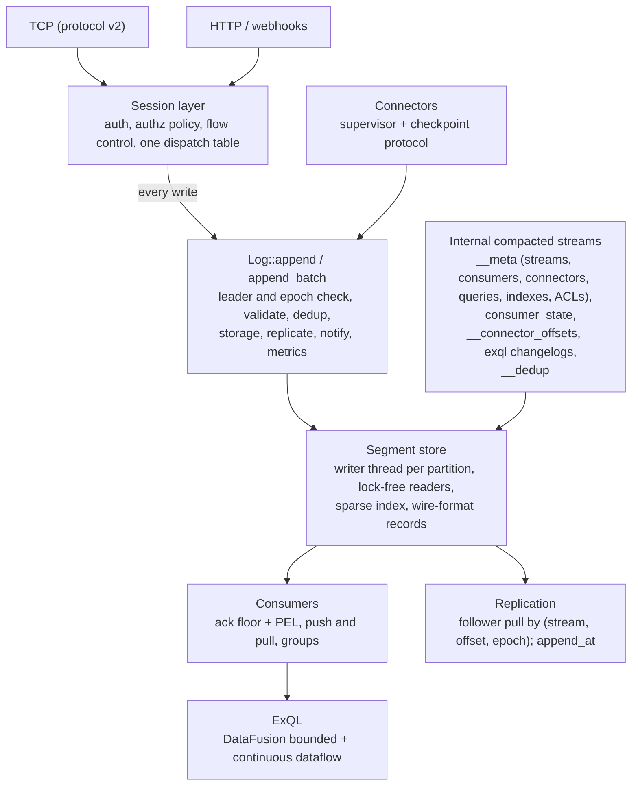

# Exspeed — Deep Review (v0.5.0, October 2026)

> Scope: every crate in the workspace, the TypeScript SDK, the Dockerfile/CI,
> and the README. Findings were verified by reading the code; the ones marked
> **[repro]** were also reproduced with throwaway tests against
> `MemoryStorage` / `FileStorage` / `Partition`. File references are relative
> to `crates/` unless stated otherwise and point at the state of `main` at
> commit `b0eed34`.

## Progress

Every finding in §2–§4 is fixed, obsolete or kept by design; [§7](#7-status-of-every-finding)
gives the status of each one and the test that proves it.

| Phase | Status |
|-------|--------|
| 0. Guard rails | ✅ CI, single test binary per crate, clippy clean, blockers 1, 2, 7, 10, 14, 15 fixed, JDBC Postgres sink fixed |
| 1. Core log | ✅ Storage engine rewritten: per-partition writer thread with group commit, lock-free readers with a high watermark, sparse indexes, fence-on-error, crash-safe sidecars and truncation, compaction, `append_at`. Bloom, secondary-index and S3 tiering code removed. Records stored in the client wire format (segment format v3): `Read`, push and pull replies are built from raw segment bytes without decoding (see [architecture.md](architecture.md#storage-layout)). Torn-write and fault-injection tests, kill -9 loops against the real binary, real-disk ENOSPC tests (tmpfs in CI; a full disk answers 507) and seeded model-based property tests (offsets monotonic and dense across crash, restart and retention; no duplicates). |
| 2. Consumers + protocol v2 | ✅ protocol v2 ([protocol.md](protocol.md)) with a new session layer (handshake/idle timeouts, out-of-order replies, bounded waits, cleanup on every exit path); JetStream-style consumers in the broker (push with credits + pull, ack/nack/term/in-progress, ack timeout, backoff, max_deliver, DLQ, `max_ack_pending`, work sharing across connections and instances, immediate redelivery when a subscriber leaves), state in the compacted `__consumers` stream; old consumer stores and work coordinators removed; HTTP consumer CRUD + seek and `/records` browsing; `exspeed-client` Rust crate with a coalescing publisher; integration tests and the bench rewritten on it; TypeScript SDK v2 with real-server e2e tests. |
| 3. Ops | ✅ `exspeed.toml` (defaults < file < env < flags, `exspeed config print-default/validate/show`, one `[cluster]` section), ordered shutdown (drain → connectors → queries → resign + lease release → consumer state → dedup snapshot → fsync), TLS/handshake/idle timeouts, Helm chart (config map, probes, ServiceMonitor), cargo-chef Docker build, `exspeed healthcheck`, online backup (`GET /api/v1/backup`, `exspeed backup`: per-stream point-in-time tar with manifest) and offline `exspeed restore` (validated, staged), OpenAPI 3.1 at `/api/v1/openapi.json` (utoipa; tests keep it in sync with the router), Linux benchmark refresh ([BENCHMARKS.md](../BENCHMARKS.md)) with a Kafka/NATS comparison kit in `bench/compare/`. Kafka/NATS comparison published (see [BENCHMARKS.md](../BENCHMARKS.md#comparison-with-kafka-and-nats-jetstream)). |
| 4. ExQL v2 | ✅ DataFusion bounded engine, continuous dataflow (event-time windows, joins, durable tables, checkpoints, effectively-once output), indexes removed, differential tests — see [exql.md](exql.md) |
| 5. Connectors v2 | ✅ checkpoint protocol, supervisor, typed settings, error taxonomy, log-backed offsets, plugin fixes; tests against real services in CI: Postgres (CDC, outbox, poll), RabbitMQ (source and sink), an S3-compatible store (S3 sink; moto in CI), MySQL and SQL Server (JDBC sink, `jdbc_poll`, `mssql_cdc`); each of those plugins has a crash/resume test proving at-least-once (effectively-once for upsert/idempotent targets and dedup-keyed sources) — see [connectors.md](connectors.md#testing-against-real-services) |
| 6. HA | ✅ Epoch-fenced lease (stable node ids, ISR in the lease, bounded heartbeat with local deadline; Postgres, Redis, in-memory backends sharing one conformance suite), pull replication of every stream with KIP-101 divergence truncation, metadata and retention mirroring, `acks = all` + `min_insync_replicas` + ISR-gated election, promotion that rebuilds dedup state, leader hints in the protocol/HTTP/SDKs, `GET /api/v1/cluster`, cluster metadata (consumers, connector configs and offsets, ExQL queries and connections) in compacted internal streams reloaded at each tenure, in-process multi-node failover tests — see [high-availability.md](high-availability.md). TLS on the cluster port, `acks = "quorum"`, a Jepsen-style randomized partition/restart test (fault-injecting proxy on replication links plus lease partitions) and a kill -9 test of a real 3-process cluster on Postgres: no acknowledged write lost, no duplicates, identical logs. Every node holds every stream by design (no per-stream replication factor, see high-availability.md). Embedded Raft in place of the external lease stays a possible later step. |

## Contents

1. [Verdict](#1-verdict)
2. [Top 15 blockers](#2-top-15-blockers)
3. [Findings by subsystem](#3-findings-by-subsystem)
   - [3.1 Storage](#31-storage-exspeed-storage)
   - [3.2 Protocol & common](#32-protocol--common)
   - [3.3 Broker: delivery, consumers, dedup](#33-broker-delivery-consumers-dedup)
   - [3.4 HA: leadership & replication](#34-ha-leadership--replication)
   - [3.5 ExQL](#35-exql-exspeed-processing)
   - [3.6 Connectors](#36-connectors-exspeed-connectors)
   - [3.7 Server, HTTP API, auth](#37-server-http-api-auth)
   - [3.8 TypeScript SDK](#38-typescript-sdk)
   - [3.9 Build, CI, deploy, benchmarks](#39-build-ci-deploy-benchmarks)
4. [Docs vs. reality](#4-docs-vs-reality)
5. [Proposed target architecture](#5-proposed-target-architecture)
6. [Phased plan](#6-phased-plan)
7. [Status of every finding](#7-status-of-every-finding)

---

## 1. Verdict

The project has an impressive surface area: a log store, push delivery, consumer
groups, dedup, HA with replication, multi-tenant auth, TLS, a SQL engine with
windows, joins and materialized views, a dozen connectors, an SDK, and a
benchmark harness. The trouble is that **almost every feature is wired only
along its happy path, and several core guarantees are wrong**. The README
describes the intended system, not the one that exists. Many tests assert
"returned `Ok`" or "`row_count >= 1`" rather than the property they are named
after, and **no CI runs them**.

Three themes cause most of the breakage:

1. **No single write path.** Records reach storage through at least seven
   routes: TCP publish, TCP batch publish, HTTP publish, webhooks, connector
   sources, ExQL outputs, and the DLQ. Each route does its own subset of the
   work (dedup, metrics, replication, leader check). So replication misses
   most writes, dedup misses some, followers accept writes, and so on.
2. **State lives in memory with optional side stores.** Consumer progress,
   group work queues, connector offsets, query checkpoints, materialized views,
   window and join state, and dedup maps each have their own persistence
   story (file / Postgres / Redis / S3 / none). None of them replicate, and
   several lose data on restart or failover.
3. **Breadth before depth.** Bloom filters, secondary indexes, S3 tiering,
   multi-pod HA, MSSQL CDC and external-DB joins were added before the core log,
   the consumer model and the SQL binder were correct. Each addition made the
   core harder to fix.

**Recommendation:** keep the core idea — a single binary combining an ordered
log with NATS-style subjects, Kafka-style replay and consumer groups, SQL, and
connectors — and rebuild the internals around three primitives:

- one `Log::append` path
- one durable consumer model
- internal compacted streams for *all* metadata and state

Then re-add features on top of that. [§5](#5-proposed-target-architecture) and
[§6](#6-phased-plan) lay out how. No one depends on the current wire protocol,
on-disk format or APIs, so take the breaking changes now.

### What is genuinely good and worth keeping

- The crate layering (`common → streams → storage/protocol → broker → processing/connectors → api → bin`).
- The segment + CRC32C frame format and the tail-scan recovery idea.
- The group-commit appender (`segment_appender.rs`) with sync/async modes.
- The `flock` on the data directory, the `/healthz` vs `/readyz` split, JSON logging, the connection cap, and the non-root image.
- The credential model (sha256-hashed tokens, per-stream glob permissions), constant-time compare on the TCP path, and `auth lint` / `whoami`.
- The connector config shape: TOML, `${ENV}` substitution, a DLQ with origin headers, and a retry policy.
- The bench harness design (`exspeed-bench`), with drivers and a Kafka comparison kit.
- A dedup design based on `msg_id` with first-body-wins semantics and collision detection.

---

## 2. Top 15 blockers

> **Status:** resolved, see [§7.1](#71-top-15-blockers-2).

Each blocker, if left in place, makes Exspeed lose or corrupt data, or makes
a headline feature not work at all.

| # | Area | Problem | Where |
|---|------|---------|-------|
| 1 | Storage | **Offsets reset to 0 after restart** if retention deleted all sealed segments and the active segment is empty. `next_offset` ignores the active segment's base offset. **[repro]** | `exspeed-storage/src/file/partition.rs:206-222` |
| 2 | Storage | **CREATE INDEX force-roll on an empty active segment** registers the same file as both sealed and active, so every record is returned twice. It re-runs on every restart because indexes are re-registered at boot. **[repro]** | `partition.rs:766-852`, `exspeed-processing/src/lib.rs:91` |
| 3 | Storage | A failed write or fsync rolls back `next_offset` but leaves the bytes on disk, which produces duplicate offsets or a torn mid-file frame that makes every later read fail. | `partition.rs:319-328`, `segment_writer.rs:127-132` |
| 4 | Storage | **Every read fsyncs under the partition lock, clones every segment's in-memory index, and walks every sealed segment.** Read cost grows with retained data. | `file/mod.rs:517-554`, `segment_reader.rs:165-175` |
| 5 | Delivery | **Consumer groups don't exist in single-pod mode.** With the default noop coordinator every member gets every record (broadcast), grouped acks are discarded, and nack never reaches the DLQ. | `exspeed-broker/src/delivery.rs:61-79`, `handlers.rs:418-427` |
| 6 | Delivery | Ungrouped consumers have no in-flight tracking, ack timeout or redelivery. Acks are cumulative (acking N skips every unacked offset below it) and off by one (the acked record is redelivered on resume). | `delivery.rs` `run_ungrouped`, `handlers.rs:434,602` |
| 7 | SDK | **The TS SDK ignores `RecordsBatch` (0x83) frames**, which the server sends whenever more than one record is ready. Messages are lost, and the next ack commits past them. | `sdks/typescript/src/client.ts:154-165` |
| 8 | HA | **Only single-record TCP publishes are replicated live.** Batch publish, HTTP publish, webhooks, connectors, ExQL outputs and the DLQ never reach followers. The follower apply path appends before validating, never skips duplicates, and wedges permanently after a mismatch. Record **keys are not replicated at all**. | `handlers.rs:43,113`, `replication/client.rs:575-705`, `exspeed-protocol/src/messages/replicate.rs:60` |
| 9 | HA | No fencing or epochs. The TCP data plane and `/webhooks` never check leadership. The Postgres lease heartbeat has no timeout. A demoted leader keeps accepting writes. | `exspeed/src/cli/server.rs` `handle_connection`, `exspeed-broker/src/lease/postgres.rs` |
| 10 | Auth | **TCP `Query` has no authorization.** Any authenticated identity can read any stream (and registered external DBs) via SQL. TCP `Ack`/`Nack` can move *another* consumer's offset. | `server.rs:1879`, `server.rs:1631-1700` |
| 11 | ExQL | **Numeric comparisons on JSON fields compare as text**: `payload->>'amount' > 250` returns 30 and misses 2000. **[repro]** | `exspeed-processing/src/runtime/eval.rs` `compare_values` |
| 12 | ExQL | **Bounded joins return only the ON columns.** `ON u.key = o.key` (sides swapped) returns 0 rows. In stream-stream joins a swapped key or a compound ON produces a cartesian product. **[repro]** | `planner/mod.rs` `annotate_with_seed`, `operators/join.rs:150`, `continuous.rs:741` |
| 13 | ExQL | **Continuous GROUP BY and materialized-view aggregates are never computed** (NULL per record). Windowed aggregates share one accumulator across all aggregate columns. Materialized views live only in memory and become a plain stream after a restart. **[repro]** | `continuous.rs` `detect_mode`, `windowed_aggregate.rs` `GroupAccumulator`, `lib.rs:~229` |
| 14 | Connectors | **Connector dedup is on by default and keyed on the record key**, which is an entity key (aggregate id, routing key). Only the first event per entity per 24 h gets through. | `exspeed-connectors/src/config.rs:73`, `manager.rs:615-634` |
| 15 | Connectors | **Hot-reload deletes every API-created connector and its offsets.** Editing a TOML file wipes offsets, so sinks replay from 0. PG CDC acknowledges WAL to Postgres before records are appended, so a crash loses data. | `file_watcher.rs:52-57,82-86,124-139`, `builtin/postgres.rs:351-417` |

---

## 3. Findings by subsystem

Severity: **C** critical · **H** high · **M** medium · **L** low.

### 3.1 Storage (`exspeed-storage`)

> **Status:** resolved, see [§7.2](#72-storage-31). The file
> and line references below point at the old engine.

| Sev | Finding | Where | Fix |
|-----|---------|-------|-----|
| C | Offsets reset to 0 after restart when the active segment is empty (blocker 1). | `file/partition.rs:206-222` | `next_offset = max(next_offset, active_base)` |
| C | `roll_segment` on an empty active segment pushes it into `sealed_readers` and then fails `create_new` with AlreadyExists, which is only logged as a warning. Records come back twice. | `partition.rs:766-852` | Never roll empty segments. Make roll transactional: create the new writer first, then swap state. |
| C | Partial write or fsync failure: `next_offset -= n` runs but the bytes stay on disk. `bytes_written` has already been bumped. A failed roll after a durable append returns `Err`, so the client retries and creates a duplicate. | `partition.rs:319-328`, `segment_writer.rs:127-132` | On error, `set_len(last_good)` or fence the partition read-only. Report a roll failure separately from the append result. |
| C | Reads call `sync_active()` (fdatasync) **under the partition mutex**, clone `Vec<SegmentReader>` including the dense per-record hash index (about 21 B per record), and call `read_from` on every sealed segment. A miss falls back to a full decode, and the active segment is always scanned from its start. | `file/mod.rs:517-554`, `segment_reader.rs:165-175` | Binary-search an `Arc<[SegmentMeta]>`, read lock-free up to an atomic committed length, no fsync on reads. |
| C | S3 tiering: eviction deletes `.seg` files that live `SegmentReader`s still reference, so every read of that stream fails with NotFound. Evicted ranges are never read back from S3 because `OffsetOutOfRange` is not handled. The "LRU" never calls `touch`, so it behaves as FIFO. `reload_partition` races the appender. **[repro]** | `s3/cache.rs:85-90`, `s3/mod.rs:137-190` | Remove S3 tiering until the read path uses segment metadata. Re-add it as a segment-store abstraction. |
| C | S3 tiering only wraps broker and connector storage. ExQL, the HTTP API and retention use raw `file_storage`. | `exspeed/src/cli/server.rs:681,723,750` | Same as above. |
| H | `seek_by_time` ignores sealed segments when the target is before the first sealed timestamp (it returns `next_offset`). Otherwise it returns the sparse floor entry, up to 255 records early. This breaks dedup rebuild (duplicates are accepted after restart), timestamp-filtered ExQL and SEEK. **[repro]** | `partition.rs:374-395`, `time_index.rs:145-160` | Seek using segment metadata, then a bounded scan forward to the first record ≥ ts. |
| H | Subject, header key and header value lengths and the header count are encoded `as u16` without checks. A 70 KB subject makes the stream permanently unreadable at that offset. HTTP publish doesn't bound the subject. | `encoding.rs:31,48-52`, `exspeed-api/src/handlers/streams.rs:367,408` | Validate at ingress. Encoders return `Result`. |
| H | `fsync`, `roll_segment` (which re-reads a 256 MB segment twice to build indexes and bloom) and secondary-index backfill all run on tokio worker threads while holding the partition lock. | `segment_appender.rs:188-191`, `partition.rs:873-938`, `file/mod.rs:863` | Use a dedicated writer thread per partition and build indexes incrementally. |
| H | `truncate_from` never updates the async syncer's file handle, so fsync targets a deleted file. A crash mid-rewrite leaves the `u64::MAX` placeholder segment as the active segment. | `partition.rs:568-719` | Make truncation a crash-safe rename protocol. |
| M | No directory fsync after segment create or delete. `.bloom`, `.sidx` and `stream.json` are written in place. One corrupt `stream.json` aborts retention for every stream after it. | `file/mod.rs:401` | tmp + rename + dir fsync. Handle errors per stream. |
| M | Startup decodes every sealed segment (`last_offset()`). `OffsetIndex::load` reads 12 bytes per syscall. All dense indexes stay resident in RAM. | `partition.rs` `open` | Sparse mmap'd index files, plus segment metadata in a footer or sidecar. |
| M | A corrupt length field allocates up to 4 GB. A bloom file with `num_bits=0` panics with divide-by-zero. Mid-file corruption in sync mode is silently truncated. | `segment_reader.rs`, `bloom_filter.rs` | Bounds checks, and fail loudly in sync mode. |
| M | In async mode, fsync failures are only logged, so acknowledged data silently loses durability. | `segment_syncer.rs:103` | Fence the partition and surface the error in health. |
| M | Secondary indexes: only top-level fields are indexed. Build errors are swallowed. IndexScan treats a missing `.sidx` as "no match" (false negatives). `IndexScan` reads one record per hit. | `secondary_index.rs`, `exspeed-processing/.../scan.rs` | Remove for now (see §5). |
| L | `StorageSyncMode::Async.threshold_bytes` is unused. `SealedSegmentInfo.record_count` is always 0. Comments still say WAL / `wal.log`. | — | — |

**Tests that don't test what they claim:**

- `crash_recovery_replays_wal` drops storage cleanly, so it never simulates a crash (`Drop` calls `sync_all`).
- `append_batch_…_via_one_wal_sync` never counts syncs.
- Nothing covers a restart with an index, two indexes, an empty active segment after retention, seeks across segments, or eviction.

### 3.2 Protocol & common

> **Status:** resolved, see [§7.3](#73-protocol--common-32).

| Sev | Finding | Where |
|-----|---------|-------|
| H | `Fetch.max_records` is an unbounded `u32` (×4 with a filter). `StartFrom::Latest` reads `usize::MAX` records into memory to find the tail. Response frames have no byte cap, and anything over 16 MB is rejected by the client decoder, which drops the connection. | `exspeed-broker/src/handlers.rs:183-192,297` |
| M | `RecordsBatch::decode` calls `with_capacity(u32)` with a value taken straight from the network. `PublishBatch` encodes the record count `as u16`, so batches over 65,535 records silently lose records. | `exspeed-protocol/src/messages/*` |
| M | Frame decode errors (bad version, opcode or size) close the connection without an Error frame. There is no version negotiation. | `exspeed-protocol/src/codec.rs` |
| M | `RecordsBatch` has no `next_offset` or high-watermark field, so a filtered fetch that returns nothing can't be told apart from "caught up". | — |
| M | Dead opcodes: `DeleteStream`, `StreamInfo`, `QueryCancel` and `RebalanceAck` are defined in both Rust and the SDK but answered with "unhandled". `Rebalance`, `Drain` and `StreamInfoResp` are never sent. | `messages/mod.rs` `from_frame` |
| L | Subject matching allocates two `Vec`s per record per subscription. `>` in a non-final position is silently treated as final (`a.>.c` matches `a.x`). Published subjects aren't validated (empty tokens and wildcards are accepted). | `exspeed-common/src/subject.rs` |

### 3.3 Broker: delivery, consumers, dedup

> **Status:** resolved, see [§7.4](#74-broker-delivery-consumers-dedup-33).

| Sev | Finding | Where |
|-----|---------|-------|
| C | Consumer groups broadcast in single-pod mode. `ConsumerGroup::route_record` is dead code, and the `groups` map is written but never read. `multi_subscriber_test` only checks that subscribe returns Ok. | `delivery.rs:61-79`, `consumer_state.rs` |
| C | The Redis work coordinator ZADDs the same member (`{"attempts":0}`) for every offset, so only one pending entry exists per group. `delivery_head` still advances, so the other records are skipped permanently. There are no tests. | `work_coordinator/redis.rs` `enqueue` |
| C | **Zombie subscribers.** Every `framed_write.send(..).await?` and decode-error `return` in `handle_connection` skips the unsubscribe cleanup. The consumer then answers "already subscribed" until restart, and SDK reconnects fail. The broker map holds a `tx` clone, so when the delivery task exits (for example on `OffsetOutOfRange`) the client hangs silently. | `server.rs` (cleanup at ~2003), `broker.rs:240-246` |
| H | Ungrouped consumers have no at-least-once machinery (blocker 6). | `delivery.rs`, `handlers.rs:434,602` |
| H | Grouped coordinator (Postgres/Redis): state is keyed by group name only, not by stream or consumer. `delivery_head()` returns 0 for both "no row" and "head = 0", so offset 0 is redelivered after every ack. Ack timeouts re-claim forever and never DLQ. Entries trimmed by retention are skipped without being acked, so the group stalls at `max_ack_pending`. Each subscriber issues about 5 SQL round-trips every 50 ms. `ack_timeout`, `max_ack_pending` and batch size are hard-coded. | `work_coordinator/*`, `delivery.rs:55-57,161,238` |
| H | Dedup: TCP publishes are accepted before `rebuild_stream` finishes (only `/readyz` waits). `append_batch` writes intra-batch duplicates twice and ignores `max_entries`. The map isn't cleared on stream delete, so a recreated stream answers `Duplicate` for a record that doesn't exist. `Instant::now() - window` panics on fresh hosts (use `checked_sub`). | `broker_append.rs:430-498,650,739`, `server.rs:617` |
| H | Promotion doesn't reload consumers. After failover, consumers created since boot are "not found", deleted ones reappear, and offsets are stale. | `server.rs:613` |
| M | Debounced file consumer store: a delete followed by a pending flush resurrects the consumer. A `Seek` save is overwritten by an older pending config. Concurrent writers share one `.tmp` path. One bad JSON file blocks broker startup. | `consumer_store/file.rs` |
| M | `Seek` doesn't move a running delivery task's cursor, and is ignored for grouped consumers. | `handlers.rs` |
| M | Backpressure is an mpsc of 8192 batches × 100 records, about 800k records buffered per subscriber, with no credit-based flow control. The queue-depth metric hard-codes capacity 1000. | `queue_depth_task.rs:10` |
| M | The DLQ append is not idempotent and bypasses replication. `{stream}-dlq` can exceed the name-length limit. | `handlers.rs:586` |

### 3.4 HA: leadership & replication

> **Status:** resolved, see [§7.5](#75-ha-leadership--replication-34).

| Sev | Finding | Where |
|-----|---------|-------|
| C | Live replication covers only TCP single publish and create stream. Followers discover the other writes only as an "offset mismatch" on the next replicated record. | `handlers.rs:43,113`, `broker.rs:116` |
| C | Follower apply appends first and checks `assigned == base+i` afterwards, never skips records it already has (the docstring at `replication/server.rs:22-27` claims it does), and loops forever after a mismatch because `reconcile_manifest` compares only the cursor, not the storage tail. Reseed recreates the stream (offsets restart at 0) but sets cursor = `new_earliest`, so it always mismatches. A unit test enshrines this. | `replication/client.rs:575-705`, `tests/replication_client_test.rs:615` |
| C | `ReplicatedRecord` has no `key`, so the follower writes `key: None`. After failover every key is gone. | `exspeed-protocol/src/messages/replicate.rs:60`, `client.rs:655` |
| C | No fencing: a demoted leader keeps serving open TCP connections. The Postgres lease `refresh` has no statement or socket timeout, so on a black-holed network it hangs and never demotes. An unambiguous "stolen" result waits for a second failure, guaranteeing about 10 s of dual leadership. Lease backends use a single connection with no reconnect. Divergence handling only covers "follower log is longer"; there is no leader epoch. | `lease/postgres.rs`, `lease/redis.rs`, `leadership.rs`, `client.rs:378` |
| H | `RetentionUpdated` is never emitted and is ignored by followers. The manifest sends `max_age/max_bytes = 0`. | `client.rs` (TODO "wave 6") |
| H | Shutdown never releases the lease (`ClusterLeadership` has no release or `Drop`), so every rolling deploy waits the full TTL. The comment at `server.rs:740` claims otherwise. | `leadership.rs`, `server.rs:740` |
| M | All HA integration tests are `#[ignore]` (they need Postgres). The divergent-history test passes even if truncation never happens. The reseed test only checks a metric. | `exspeed/tests/replication_*`, `multipod_*` |

### 3.5 ExQL (`exspeed-processing`)

> **Status:** resolved, see [§7.6](#76-exql-35).

**Correctness**

| Sev | Finding | Where |
|-----|---------|-------|
| C | JSON-vs-number comparisons fall back to comparing strings. `->>` always returns Text and `->` returns Json. `to_sort_key` sorts every Int before every Float and puts NULLs first. **[repro]** | `runtime/eval.rs` (~303), `types.rs` |
| C | Bounded joins drop every column not named in ON. **[repro]** | `planner/mod.rs` `annotate_with_seed` |
| C | Join-key extraction assumes the left side of `=` belongs to the left input. A compound ON (`AND`) uses the whole boolean as the key. The `tbl.col` → `col` fallback silently reads the other table's column. NULL keys become the string `"NULL"`, so NULL keys match each other. **[repro]** | `operators/join.rs:150`, `continuous.rs:741`, `stream_join.rs:30`, `eval.rs:17-23` |
| C | Windowed aggregates share one `count`/`sum`/`min`/`max` across every aggregate column. `COUNT(x)` counts NULLs. DISTINCT is ignored. **[repro]** | `operators/windowed_aggregate.rs` |
| C | Continuous non-windowed GROUP BY goes through the "Simple" path, where `Expr::Aggregate` evaluates to NULL. This breaks the README's headline continuous-query and materialized-view examples. **[repro]** | `continuous.rs` `detect_mode` |
| C | Materialized views are an in-memory HashMap only. On resume `mv_state = None`, so after a restart the view becomes an output stream. A view without GROUP BY keeps only the last row. The test asserts `row_count >= 1`. | `lib.rs:~229`, `continuous.rs:~520` |
| C | Continuous queries checkpoint only source offsets, every 10 s, via a non-atomic `fs::write`. Window and join state is lost on restart. **Stopped and failed queries restart on every boot or leadership change.** Demotion drops the work future without checkpointing. | `query_registry.rs:224`, `lib.rs` `resume_all_and_run` |

**Clauses parsed but silently ignored**

| Sev | Finding | Where |
|-----|---------|-------|
| H | `HAVING`, `DISTINCT`, aggregate `FILTER (WHERE …)` and `OVER (…)` are dropped. Unknown functions return NULL. Scalar subqueries return NULL. `GROUP BY 1` and `GROUP BY alias` collapse all rows into one group. **[repro]** | `parser/transform.rs` `transform_select`, `functions.rs:59`, `eval.rs:150` |
| H | Only top-level aggregates are computed: `SUM(x)/COUNT(*)`, `ROUND(AVG(x),1)` and `COALESCE(SUM(x),0)` all give NULL. A non-column grouping expression is output as NULL, so the README query `GROUP BY payload->>'region'` returns `region = NULL`. **[repro]** | `operators/aggregate.rs:96-110` |
| H | ORDER BY runs after projection, so ordering by a column that isn't selected, or by `COUNT(*)`, does nothing. **[repro]** | `planner` `build_logical` |

**Time and windows**

| Sev | Finding | Where |
|-----|---------|-------|
| H | Timestamps are milliseconds in bounded queries and nanoseconds in continuous ones. `NOW()` returns ns. `INTERVAL '1 hour'` always evaluates to NULL, so `timestamp > now() - INTERVAL '1 hour'` returns 0 rows. The time lower bound passes ms to a ns `seek_by_time`. **[repro]** | `row_builder.rs`, `continuous.rs:~806`, `functions.rs` |
| H | Windows close on the wall clock, not event time. On replay, EMIT FINAL emits several partial "final" rows. Grace is hard-coded to 5 minutes. A unit `parse_interval_nanos` doesn't recognise (`'1 week'`, `'500 ms'`, `'1h'`) yields 0 and a **divide-by-zero panic**, while the status stays "running". | `continuous.rs:~358,391`, `windowed_aggregate.rs` |
| H | Stream-stream joins: `LEFT` is parsed and then run as inner. There is no `\|t_l - t_r\| <= within` check. Eviction uses the wall clock. In a 3-way join the middle stream is dropped. WITHIN values are assigned to joins by position. | `stream_join.rs`, `continuous.rs` `decompose_plan` |
| H | A continuous stream-table join reads the right side once at startup and never refreshes it. | `continuous.rs` `build_join_lookup` |

**Robustness, indexes and external DBs**

| Sev | Finding | Where |
|-----|---------|-------|
| H | Panics on user input: a join build side over 100k rows, more than 100k groups, a zero window, and Unicode byte slicing in the WITHIN/EMIT pre-parser. There is no query timeout or cancellation. `MAX_RESULT_ROWS = 10_000` truncates silently. | `join.rs:56`, `aggregate.rs:66`, `parser/mod.rs:97-110` |
| H | A missing stream returns 0 rows instead of an error. | `operators/scan.rs` |
| H | Index lifecycle: `DROP INDEX` deletes only the JSON file. Recreating an index with the same name on a different field keeps indexing the old field (false negatives). **The index name isn't validated, so `DROP INDEX ../consumers/foo` deletes consumer state.** | `api/handlers/queries.rs:208`, `lib.rs` |
| H | External DB joins: SQL injection via `format!("SELECT * FROM {table}")`. The inline `postgres('url','t')` form lets any query user make the server connect anywhere (SSRF). Each query fetches the whole table and opens a new pool. Not supported in continuous queries. MSSQL is a stub. | `external/postgres.rs:27`, `external/connections.rs` |

**Medium**

| Sev | Finding | Where |
|-----|---------|-------|
| M | NULL `NOT IN` / `NOT BETWEEN` evaluate to true. Arithmetic goes through f64 (precision loss above 2^53, `7/2 = 3.5`). LIKE is case-insensitive. `CAST(x AS DECIMAL(10,2))`, `VARCHAR(n)` and `TIMESTAMP` give NULL. No JSON array indexing. A payload key containing an escape sequence nulls every `->>` on that record. `headers` is not a column in bounded queries. | `eval.rs`, `functions.rs` |

**ExQL feature matrix (claimed vs actual)**

| Feature | Status |
|---|---|
| SELECT / WHERE / LIMIT / OFFSET | ✅, except JSON-number comparison |
| JSON `->`, `->>` | ⚠️ untyped text, no arrays |
| GROUP BY + aggregates (bounded) | ⚠️ plain columns only; expressions over aggregates give NULL |
| HAVING / DISTINCT / FILTER / window functions | ❌ parsed and ignored |
| ORDER BY | ⚠️ projected columns only |
| `INTERVAL`, `NOW()` filters | ❌ always 0 rows |
| Bounded INNER / LEFT JOIN | ❌ only ON columns returned |
| Continuous filter / project | ✅ at-least-once |
| Continuous GROUP BY / materialized-view aggregates | ❌ NULL per record |
| Tumbling windows | ⚠️ correct with a single aggregate only |
| EMIT FINAL | ⚠️ wall-clock based, duplicates on replay |
| Hopping / sliding / session windows, watermarks | ❌ not present |
| Stream-stream join WITHIN | ⚠️ inner join, single `=` key, live data only |
| Stream-table join (continuous) | ⚠️ startup snapshot, never refreshed |
| External DB join | ⚠️ bounded only, insecure |
| Materialized views | ❌ in memory, lost or changed on restart |
| Restart and state recovery | ❌ offsets only; state is lost |

### 3.6 Connectors (`exspeed-connectors`)

> **Status:** resolved, see [§7.7](#77-connectors-36); current guarantees
> and their tests are in [connectors.md](connectors.md#delivery-guarantees).

| Sev | Finding | Where |
|-----|---------|-------|
| C | Dedup is on by default, keyed on the entity key, with an unbounded in-memory cache (blocker 14). | `config.rs:73`, `manager.rs:615-634` |
| C | The file watcher deletes every connector without a matching `<name>.toml`, which includes all API-created connectors, and takes their offsets with them. It runs on followers too. A file whose name differs from `[connector].name` loops delete→create on every event. | `file_watcher.rs:52-57,124-139` |
| C | TOML edits are applied as `delete()` + `create()`, and `delete()` drops offsets. | `file_watcher.rs:82-86`, `manager.rs:189` |
| C | PG CDC and the CDC outbox call `update_applied_lsn()` inside `poll()`, so Postgres's `confirmed_flush_lsn` advances before the records are appended. A crash loses data, and the offset store can't recover it. | `builtin/postgres.rs:351-417`, `postgres_outbox.rs:403-431` |
| C | PG CDC: the key is a random column (`HashMap::values().next()`). Unchanged TOASTed columns become `null`, so a downstream upsert nulls real data. All values are strings. The old tuple is dropped. | `pgoutput.rs:332-337`, `postgres.rs:651` |
| C | A source append failure (including transient `DedupMapFull`, disk full or lost leadership) is DLQ'd or silently dropped, and the source offset still advances. | `manager.rs:684-731` |
| C | The S3 sink returns `AllSuccess` for records that are only in a memory buffer. There is no timed flush. `flush()`/`stop()` are never called, so the buffer is lost on restart. A failed flush duplicates the buffer. | `s3_sink.rs:259-271`, `manager.rs:1075` |
| H | `ConnectorStatus::Failed` is never set. Nothing restarts connectors, and none of them reconnect: a PG or RabbitMQ blip leaves them dead or silently stalled while reporting healthy. | `manager.rs` |
| H | Stop is fire-and-forget, so a restart races the old instance for the replication slot. `source.stop()`, `sink.flush()` and `sink.stop()` are never called. | `manager.rs:1091` |
| H | Replication slots and publications are never dropped. The keepalive path never advances the LSN, so WAL bloat is unbounded on idle tables. There is no slot-lag metric. | `postgres.rs:423`, `pgoutput.rs:253` |
| H | PG poll mode: `col_to_string` can't decode timestamp, numeric, uuid or json, so the cursor becomes `"<null>"` and polling stops after the first batch. | `postgres.rs:67` |
| H | Outbox poll: only String/i64 are decoded, so an int4 id, a UUID or a JSONB payload makes every poll error. `id > last` misses rows from transactions that commit out of order. | `postgres_outbox.rs:582-605` |
| H | mssql_cdc: `from_lsn` is inclusive, so the last transaction is re-emitted on every poll. A transaction larger than `batch_size` loops forever. `"String(None)"` is emitted literally. | `mssql_cdc.rs:181,259` |
| H | JDBC sink: unknown SQLSTATEs are treated as transient and the default policy is `LoopForever`, so one bad record stalls the pipeline. MySQL and MSSQL duplicate-key codes aren't recognised. | `jdbc/mod.rs:56` |
| H | HTTP sink: every 4xx (including 401, 408 and 429) is treated as poison. There is no request timeout. | `http_sink.rs:111` |
| H | Webhook auth defaults to `none`, and the bearer comparison isn't constant-time. Webhook writes skip dedup, metrics, replication and the leader gate. | `http_webhook.rs:27-35`, `exspeed-api/src/handlers/mod.rs:65` |
| H | Offset stores: the file store uses a non-atomic `fs::write`, and on a load error the connector restarts from 0. The S3 store maps any error to "no offset". The PG store never reconnects. The stream store scans `__exspeed_offsets` from 0 on every load. | `offset.rs:18`, `offset_store/*` |
| M | `subject_template` placeholder syntax differs per plugin: webhook uses `{$.field}`, outbox `{aggregate_type}`, postgres `{schema}`/`{table}`. The README used `{{field}}`. Transforms are configured in TOML as `[transform] sql = …` but over the API as `transform_sql`, and the README put `transform_sql` under `[settings]`, where it is ignored. | `http_webhook.rs:75`, `postgres_outbox.rs:151`, `postgres.rs:557`, `config.rs:139` |
| M | `http_poll` truncates responses at `max_batch` and has no pagination. The pgoutput parser panics on short buffers. TOML configs are persisted as JSON with **resolved secrets in plaintext**. A stale JSON copy wins over an edited TOML file. Connector names aren't validated (`../x`). `dry-run` on a CDC source creates the slot and acknowledges a transaction. The RabbitMQ sink publishes non-persistent, non-mandatory messages. | various |

**Delivery guarantee actually achieved, per connector (default config):**

| Connector | Dir | Actual | Main gaps |
|---|---|---|---|
| http_webhook | src | at-most-once, unreplicated | open by default, bypasses broker |
| postgres (cdc) | src | at-most-once | early LSN ack, dedup drops, random key, TOAST→null |
| postgres (poll) | src | stops after first batch | timestamp decode |
| postgres_outbox | src | at-most-once | dedup on aggregate_id, int4/uuid/jsonb fail |
| jdbc_poll | src | at-least-once (with dedup off) | id gaps |
| mssql_cdc | src | duplicates; stalls on large transactions | inclusive LSN |
| rabbitmq | src | at-most-once (dedup on routing key) | no reconnect |
| http_poll | src | lossy | truncation, no cursor |
| jdbc | sink | at-least-once (effectively-once with upsert) | error taxonomy, row-by-row writes |
| http_sink | sink | at-least-once, but drops 401/429 | no timeout |
| rabbitmq | sink | at-least-once, non-persistent | no reconnect |
| s3 | sink | **at-most-once** | buffer lost |

There are no tests for PG CDC, outbox, RabbitMQ, S3, mssql_cdc or http_poll.
The JDBC E2E tests silently pass when their env var is unset.

### 3.7 Server, HTTP API, auth

> **Status:** resolved, see [§7.8](#78-server-http-api-auth-37).

| Sev | Finding | Where |
|-----|---------|-------|
| C | TCP `Query` has no authz. Over HTTP the same operation requires global admin. | `exspeed/src/cli/server.rs:1879` |
| H | Ack/Nack authorize against the caller's own subscription but act on `req.consumer_name`, so a caller can move any consumer's offset. | `server.rs:1631-1700` |
| H | No handshake, TLS-accept or idle timeouts and no TCP keepalive: 1024 idle sockets exhaust `EXSPEED_MAX_CONNS`. | `server.rs:1076-1110` |
| H | Shutdown isn't graceful. It returns as soon as there are no connections. The final dedup snapshot task isn't awaited. The leader token isn't cancelled, so connectors and queries are aborted mid-batch. The lease isn't released. The HTTP task isn't joined. | `server.rs` `run_with_shutdown`, `:633` |
| H | Startup failures are swallowed. If HTTP fails to bind, the process keeps running with no API. `ready` is set before the listeners are bound. `exql.load()` and `connector_manager.load_all()` failures only warn. | `server.rs:1023-1030` |
| M | Scoped admins can list every tenant's streams and consumers. Metrics label `auth_denied` with the raw path (unbounded cardinality), and `subscription_queue_fill` with per-connection UUIDs. `/metrics` exposes every stream name unauthenticated. | `handlers/streams.rs:49`, `middleware.rs:66,99` |
| M | Metric names are inconsistent: `connections_active`, `consumer_lag`, `storage_bytes` and `records_published` have no `exspeed_` prefix, while the others do. Counters already named `*_total` get a doubled `_total_total` suffix from the OTel exporter. The README documented names such as `exspeed_active_connections` and `exspeed_consumer_lag_records`, which don't exist. | `exspeed-common/src/metrics.rs:154-290` |
| M | `create_continuous` registers and persists the query *before* the leader check, leaving orphans. | `exspeed-processing/src/lib.rs:312-321` |
| M | `exspeed tail` polls `POST /queries` every 200 ms with `WHERE offset >= N`, but offsets aren't pushed down, so every poll scans the whole stream. It also requires admin and interpolates `--subject` into SQL. | `exspeed/src/cli/tail.rs`, `bounded.rs:168-171` |
| L | `unsafe set_var` runs after the tokio threads exist, and nothing reads that var. `--storage-sync-bytes` and `--delivery-buffer` are no-ops. Backends use `expect`/`panic!` at init. `server.rs` is 2,000 lines with 14 copy-pasted authz blocks. | `server.rs:350` |

### 3.8 TypeScript SDK

> **Status:** resolved, see [§7.9](#79-typescript-sdk-38).

- **C** — It ignores `RecordsBatch` (0x83) frames (blocker 7).
- **H** — `Publisher` builds its own `Connection` without `auth` or `tls`, so it can't talk to a secured server. `maxInFlight` is unused.
- **H** — The `Subscription` default is `overflowPolicy: "drop-oldest"` with `maxQueueSize: 1000`, so it drops messages silently. Combined with cumulative acks, that is committed loss.
- **H** — On reconnect it only handles a 404 when re-subscribing. "Already subscribed" (the zombie-subscriber bug in §3.3) emits an unhandled `error`, and the subscription is dead.
- **M** — All 120 tests run against mock sockets. None run against a real server.

### 3.9 Build, CI, deploy, benchmarks

> **Status:** resolved, see [§7.10](#710-build-ci-deploy-benchmarks-39).

- **No CI runs tests, clippy or the SDK tests.** Only `release.yml` (cargo-dist, on tags) and a manual `benchmarks.yml` exist.
- **Dockerfile:** the dependency-cache layer omits `crates/exspeed-bench/Cargo.toml`, so the dummy build always fails (hidden by `2>/dev/null || true`), and every image build recompiles everything. It builds the bench crate into the image. There is no `HEALTHCHECK`. It doesn't expose port 5934 (replication).
- **No Helm chart or manifests.** k8s YAML exists only as README snippets.
- **Every server-starting integration test calls `portpicker::pick_unused_port().unwrap()`.** That needs IPv6, so on IPv4-only hosts all of them panic (none could run in the review container). Picking a port and binding it later is also racy. Bind `127.0.0.1:0` and pass the bound listener into the server instead.
- **53 integration-test files each link the full server.** Each test binary is about 540 MB with debug info, about 25 GB in total for `cargo test` (this exhausted the review container's disk). Consolidate them into one `tests/it/main.rs` with modules.
- **About 50 environment variables and no config file.** Multi-pod setup mixes `EXSPEED_CONSUMER_STORE=postgres` with `EXSPEED_OFFSET_STORE_POSTGRES_URL`. The 7 `EXSPEED_STORAGE_S3_*` variables are undocumented.
- **Benchmarks:**
  - They are stale (v0.2.0 on macOS, with broker and driver on the same host).
  - The fan-out table reports the producer's achieved rate, not fan-out.
  - "E2E latency @ 10k/s" in sync mode exceeds the 7k/s sync maximum.
  - BENCHMARKS.md cites a results file that doesn't exist.
  - The README promises a NATS comparison, but only a Kafka driver exists.

---

## 4. Docs vs. reality

> **Status:** resolved, see [§7.11](#711-docs-vs-reality-4).

The README was 1,620 lines. It has been split into `docs/` (see
[docs/README.md](README.md)). These are the claims that were wrong, all now
corrected or marked in the new docs:

| README claim | Reality |
|---|---|
| `exspeed query --continuous "SELECT … EMIT CHANGES"` | Errors. A continuous query must be `CREATE VIEW <out> AS SELECT …`, which writes to a stream named `<out>`. |
| `GROUP BY payload->>'region'` continuous and materialized-view examples | Run, but produce NULL aggregates (§3.5). |
| `TUMBLE(timestamp, INTERVAL '5 minutes')` | Unsupported. Only `tumbling(timestamp, '5 minutes')` works. |
| Stream join `AND p.timestamp BETWEEN …` | Unsupported. The syntax is `… ON a.key = b.key WITHIN '10 minutes'`. |
| `JOIN warehouse.customers` | Unsupported. Returns 0 rows. |
| Webhook `auth_token = …` | Ignored, so **the webhook is unauthenticated**. Real keys: `auth_type = "bearer"`, `auth_secret = …`. |
| `plugin = "postgres_cdc"` | Doesn't exist. Use `plugin = "postgres"` with `mode = "cdc"`, `tables = …`. |
| `connection_url`, `table`, `publication` (postgres/outbox) | Real keys: `connection`, `outbox_table`, `publication_name`. |
| `interval_secs = 60`, `headers = { … }` (inline TOML values) | `settings` is `HashMap<String,String>`, so non-strings fail to parse and the connector is silently skipped. Values must be strings, and headers use `"K: V, K2: V2"`. |
| RabbitMQ sink `routing_key = …` | Ignored. Uses `routing_key_from = "subject"`. |
| jdbc_poll example | Missing the required `schema` setting. |
| `transform_sql = …` under `[settings]` | Ignored. TOML uses a `[transform]` table with `sql = …`, and transforms only apply to sources. |
| `subject_template` `{{field}}` | Wrong syntax, and it differs per plugin (`{$.field}`, `{aggregate_type}`, `{table}`). |
| Metric names `exspeed_active_connections`, `exspeed_consumer_lag_records` | Don't exist. The real names are `connections_active` and `consumer_lag`. |
| `examples/order-processing` connectors | The outbox example lost every event after an order's first, because of the dedup default (fixed in this change). The `high-value-notify` sink's `[transform]` filter is ignored, since sink transforms don't run, so every `order.created` is forwarded. |
| `exspeed connector validate` | Accepts `postgres_cdc` and rejects the real `postgres`, `jdbc_poll` and `mssql_cdc`. |
| "Consumer groups (round-robin)" | Broadcast in single-pod mode (§3.3). |
| "Dead-letter queues" | Reachable only via 5 client nacks of the same offset, which the broker never redelivers. |
| "Exactly-once across failover with idempotent publish" | False (§3.3 dedup, §3.4). |
| Standbys 503 everything except leases | TCP and `/webhooks` aren't gated, and `/whoami` works. |
| Server flags table (3 flags) | 14 flags. Full list in `docs/configuration.md`. |
| HTTP reference | Missing `PATCH`/`DELETE /streams/{name}`, `/indexes`, `/whoami`, `/leases` and `/cluster/followers`. There is no HTTP endpoint to create a consumer. |
| Storage layout | Actual: `streams/<name>/partitions/0/<base>.seg` with `.idx`, `.tix`, `.bloom` and `.sidx` sidecars. |
| CLAUDE.md "StorageEngine is a sync trait" / "groups in-memory" | `StorageEngine` is async. Groups have Postgres and Redis coordinators. |

---

## 5. Proposed target architecture

The goal is a broker that is **easy to deploy, run and maintain**, faster
than Kafka for single-node and small-cluster workloads, and NATS-like in
ergonomics. Keep the single binary, the log, subjects, SQL and connectors.
Rebuild the internals around a few primitives that everything else composes
on.



### 5.1 One write path

`Log::append(stream, records, opts) -> Result<AppendAck>` becomes the only
way to write. Storage write methods become crate-private. Every write runs
these steps in order:

1. Leader and epoch check.
2. Validate subject and header sizes.
3. Dedup on `msg_id`, including within a batch.
4. Write to storage.
5. Publish to the replication feed.
6. Wake waiters through `Notify`.
7. Record metrics.

Publish, batch publish, HTTP, webhooks, connector sources, ExQL outputs, the
DLQ and internal metadata all go through it. Fixing replication, dedup,
fencing and metrics becomes a single change.

### 5.2 Storage engine

- Run **one writer thread per partition**. It does group commit, publishes an
  atomic `committed_len` / `next_offset`, and calls `Notify` for long-polling
  readers.
- Make **readers lock-free**: binary-search `ArcSwap<[SegmentMeta]>`, then
  `pread` up to the committed length. Never fsync on reads.
- Use **sparse, mmap'd relative-offset and time indexes**, appended
  incrementally for the active segment too. That removes rebuild-at-roll,
  full rescans, and the CREATE INDEX hack.
- **Fence on error**: truncate back to the last good length or mark the
  partition read-only. Use tmp+rename+dir-fsync for every sidecar. Fail loudly
  on mid-file corruption in sync mode.
- **Store records in the same format used on the wire.** A fetch then becomes
  `pread` (later `sendfile`) plus a frame header, with no decoding and no
  per-record allocation. This is the single largest performance win available.
- **Drop for now:** bloom filters, secondary indexes, S3 tiering. Re-add
  tiering later as a `SegmentStore` trait (local / object storage) beneath
  `SegmentMeta`. For NATS-style filtered consumers, a per-segment
  subject→offsets sidecar pays off more than a key bloom filter.
- **Add compaction** (keep the last record per key). Every internal metadata
  stream depends on it, and users expect it from Kafka.

### 5.3 One consumer model (JetStream-style, in the broker)

A durable consumer is:

```
{ stream, filter_subjects[], deliver_policy, ack_policy (none|explicit|cumulative),
  ack_wait, max_deliver, backoff[], max_ack_pending, dlq_stream }
state: ack_floor, sparse acked set above floor, pending (offset → deliveries, deadline)
```

- **Push and pull are two front-ends over the same state.** Pull is
  `Fetch(batch, max_bytes, expires)`. Push uses credit-based flow control,
  where the client grants N messages.
- **A group is just several subscribers on one consumer.** The broker hands
  each message to one subscriber, round-robin or key-sticky. This deletes the
  `WorkCoordinator` and its Postgres/Redis backends.
- Nack, or an ack timeout, redelivers the message with backoff. After
  `max_deliver` attempts it goes to the DLQ, written through `Log::append`.
- **Persist consumer state as records in a compacted `__consumer_state`
  stream.** It replicates and survives restarts like any other stream, which
  deletes the file, Postgres, Redis and S3 consumer stores.
- The committed offset means "next to deliver".
- The connection owns an **RAII subscription guard**, so the subscription
  always unsubscribes when the connection drops.
- When a subscription ends, the broker sends a terminal error frame.
- When a consumer's offset falls behind retention, an explicit `on_gap`
  policy (`error | earliest | latest`) decides what happens.

### 5.4 HA: Kafka-style log replication with epochs

- Followers pull from the leader by `(stream, from_offset, leader_epoch)`.
  They apply with `append_at(offset)`, which skips records the follower
  already has and rejects gaps.
- Keep a per-stream **epoch → start-offset history** and truncate to the
  divergence point on leader change, as Kafka's KIP-101 does.
- **Fence writes with a monotonically increasing epoch** taken from the
  lease, checked inside `Log::append`.
- Lease heartbeats get statement and socket timeouts. A pod demotes on the
  first "stolen" result. Startup enforces `2 × heartbeat < TTL`. The lease
  is released on shutdown.
- Make **acks configurable**: `acks=leader` (today's behaviour) or
  `acks=quorum` (wait for N followers' `fetch_offset` to pass the record).
- Since metadata, consumer state and connector offsets are all streams,
  failover needs no external database.
- **Phase 1 still uses Postgres or Redis for the lease** but stores nothing
  else there. Later, an embedded Raft for the lease alone (for example
  `openraft`, over the existing cluster port) removes the last dependency.

**If HA can't be done properly in the first rebuild, cut it from scope** and
document "single node + replicated standby (async)" honestly. Shipping
unfenced HA is worse than shipping none.

### 5.5 ExQL

Rewrite ExQL on top of **Apache DataFusion**. Patching the custom engine
operator by operator is not worth it.

- **Bounded queries** use a `TableProvider` over streams with pushdown of
  offset, time, subject and key predicates and `LIMIT`. JSON support comes
  from `datafusion-functions-json` (`->`, `->>`, typed extraction). This
  fixes types, three-valued logic, HAVING, DISTINCT, all join types, window
  functions, ORDER BY, spill-to-disk, memory limits and cancellation in one
  step.
- **Continuous queries** run as a keyed dataflow graph. The operators are
  filter, project, stream-stream join, stream-table join, window and
  aggregate.
  - DataFusion `Accumulator`s supply aggregate state.
  - Event time is declared with `TIMESTAMP BY <expr>`.
  - Watermarks are computed per source with min-merge, and support
    `GRACE PERIOD` and a late-data side output.
  - Supported windows: tumbling, hopping and session.
  - Stream-stream joins take composite equi-keys plus a residual predicate,
    and support LEFT and OUTER, with unmatched rows emitted when the
    watermark passes.
- **State lives in changelog streams on the broker**, Kafka Streams style.
  Each operator's state is a compacted `__exql.<qid>.<op>` stream, cached in
  memory or in RocksDB/redb.
  - A checkpoint atomically records source offsets, changelog offsets and
    output offsets.
  - Exactly-once output comes from writing outputs and the checkpoint in one
    `append_batch` transaction marker, or from `(qid, epoch, seq)` dedup on
    the output stream.
  - Materialized views are a compacted changelog plus an index. They are
    durable and replicated, and can be queried with `SELECT … FROM view`.
- **Clearer DDL**, following ksqlDB:
  - `CREATE STREAM out AS SELECT …` for a continuous query writing to a stream.
  - `CREATE TABLE v AS SELECT … GROUP BY …` for a materialized view.
  - `DROP STREAM`/`DROP TABLE`.
  - `PAUSE`/`RESUME QUERY`, with the desired running state persisted.
- **External databases** are reached only through registered connections,
  with parameterized lookups, an LRU and TTL cache, and support in continuous
  queries. Drop the inline URL form.
- **Testing:** a differential test suite runs the same queries on ExQL and on
  DuckDB or SQLite over the same data.

### 5.6 Connectors

- **Uniform checkpoint protocol.**
  - Sources: `poll() -> (records, Checkpoint)`. The framework calls
    `Log::append_batch` and waits for durability, persists the checkpoint to
    `__connector_offsets`, and only then calls `source.ack(checkpoint)`.
    That is where the LSN is confirmed, the AMQP message is acked, or the
    outbox row is deleted.
  - Sinks: `write(batch)`, then `flush()` as a barrier. The framework commits
    consumer progress only after `flush()` succeeds.
- **A supervisor state machine** per connector (Starting → Running →
  Backoff → Failed → Stopped). It restarts with backoff via `stop()` then
  `start()`, catches panics, awaits stop through the `JoinHandle`, and
  reports status and lag in the API and metrics.
- **Provenance:** each connector records whether it came from a file or the
  API. The watcher reconciles only file-sourced connectors, applies changes as
  an update with offsets kept, and runs only on the leader. Secrets stay as
  `${VAR}` references and are never persisted resolved.
- **Typed settings.** Each plugin declares a `serde` struct with
  `deny_unknown_fields`, so a mistyped key fails validation instead of being
  silently ignored. `exspeed connector validate` uses the same registry. The
  JSON schema of these structs produces the docs.
- **Error taxonomy**: `Transient | Poison | Fatal(config)`, with per-dialect
  SQLSTATE tables and HTTP rules (408/429/5xx are transient, 401/403 are
  fatal).
- **Dedup off by default.** It applies only to an explicit idempotency key
  and is handled by `Log::append`.
- **CDC envelope** in the style of Debezium: before, after, op, source LSN or
  txid, typed values, and an "unchanged TOAST" marker.
- **Fewer connectors, done properly.** Fix and test webhook, HTTP sink,
  Postgres CDC, outbox, JDBC sink and S3 sink against real services in CI.
  Move the rest (MSSQL CDC, jdbc_poll, http_poll, RabbitMQ) behind an
  `experimental` label until they have tests. Later, add WASM or
  out-of-process plugins once the protocol is stable.

### 5.7 Operations

- Add **one config file**, `exspeed.toml`, layered as defaults < file < env
  < flags. It is resolved and validated into a `ServerConfig` before anything
  starts. Add `exspeed config validate` and `exspeed config print-default`.
  Collapse the CONSUMER_STORE / OFFSET_STORE / LEASE / WORK_COORDINATOR
  variables into a single `[cluster]` section.
- **Split `server.rs`** into `config`, `bootstrap`, `tcp/session` (one
  dispatch table plus one `authorize(op, identity)` policy) and `shutdown`.
  Track every task in a `TaskTracker`, and shut down in this order:
  1. Stop accepting new connections.
  2. Drain existing connections.
  3. Stop connectors and queries, committing their progress.
  4. Final snapshot and fsync.
  5. Release the lease.
  6. Join everything.
- Make listener bind failures fatal, and set `ready` only after the listeners
  are bound.
- Add connection timeouts: handshake, TLS accept, idle, and TCP keepalive.
- **Deploy artifacts:**
  - A Helm chart (StatefulSet, PVC, `fsGroup`, probes, Secret, ServiceMonitor).
  - A Docker build using cargo-chef, building only `-p exspeed`.
  - An `exspeed healthcheck` command for the Docker `HEALTHCHECK`.
  - An online `exspeed backup` / `restore`.
- **CI:**
  - `fmt`, `clippy -D warnings`, `cargo test` and the SDK tests.
  - A docker-compose connector suite.
  - An SDK↔server e2e suite.
  - A nightly benchmark on Linux that reports achieved rates.
- **API:** OpenAPI generated with utoipa, one error shape for HTTP and TCP,
  pagination, identity-scoped list endpoints, and bounded metric labels.

---

## 6. Phased plan

Each phase ends with a green CI and tests that assert the guarantee, not just
the status code.

| Phase | Goal | Contents | Exit criteria |
|------|------|----------|---------------|
| **0. Guard rails** (days) | Stop lying, start measuring | CI workflow (fmt, clippy, test, SDK). Consolidate integration tests into one binary. Delete or feature-gate dead code (`ConsumerGroup::route_record`, dead opcodes). Mark experimental features in the docs. Fix the README (done in this change). Hot-fix blockers 1, 2, 7, 10, 14 and 15 (each is small). | CI green on every PR. |
| **1. Core log** | A storage engine you can trust | One `Log::append`. Writer thread with lock-free readers. Sparse indexes. Fence-on-error. Wire-format records. Ingress validation. Compaction. Remove bloom, secondary-index and S3 tiering code. Crash tests with fault injection (kill -9 loops, ENOSPC, torn writes). | Property tests: offsets monotonic across crash, restart and retention; no duplicates; reads O(log segments). |
| **2. Consumers** | NATS JetStream semantics | Durable consumer model (§5.3). Push with credits plus pull. Groups as shared consumers. Ack wait, max deliver, backoff, DLQ. `__consumer_state` stream. Protocol v2 (byte-bounded fetch, next_offset/HWM, error frames, version negotiation). SDK rewritten against v2 with a real-server e2e suite. | Tests: no loss or duplication across disconnect and restart; round-robin distribution; DLQ after `max_deliver`. |
| **3. Ops** | Easy to deploy and run | `exspeed.toml`, the `server.rs` split, ordered shutdown, timeouts, Helm chart, healthcheck, backup and restore, OpenAPI, refreshed benchmarks on Linux (single node vs Kafka and NATS). | One-command deploy on k8s and Docker. Published benchmark repro. |
| **4. ExQL v2** | Correct SQL over streams | DataFusion bounded engine. Continuous dataflow with watermarks, changelog state, exactly-once outputs, `CREATE STREAM` and `CREATE TABLE`. Differential test suite. | Differential tests pass. Restart-recovery tests for windows, joins and tables. |
| **5. Connectors v2** | Robust sources and sinks | Checkpoint protocol, supervisor, typed settings, error taxonomy, CDC envelope. Connector CI against real PG, MySQL, RabbitMQ and MinIO with crash and resume tests. | Per-connector crash/resume tests prove at-least-once (effectively-once for upsert sinks). |
| **6. HA** | Replicated, fenced cluster | Epoch-fenced log replication, `acks=quorum`, metadata via internal streams, lease-only external dependency (then embedded Raft). Jepsen-style partition tests. | No acknowledged-write loss under `acks=quorum` in partition and kill tests. |

---

## 7. Status of every finding

After the phases landed, every finding in §2–§4 was re-checked against the
code by four independent audits that turned the old repros into tests, and
each remaining gap was fixed. Statuses:

- **Fixed**: the code changed and the named test proves it (tests are
  `module::test` within the crate named, or `it::<module>` for a crate's
  integration binary).
- **Obsolete**: the code the finding described was deleted; its
  replacement is tested.
- **By design**: kept on purpose and documented where users will look.

Rows of the §3 tables are numbered in order, starting at 1.

### 7.1 Top 15 blockers (§2)

| # | Status | Evidence |
|---|--------|----------|
| 1 | Fixed | `next_offset = max(end, active base, previous end)` on recovery. `exspeed-storage` `file_tests::restart_after_retention_with_empty_active_segment_keeps_offsets_monotonic`, plus the model-based `property_tests` |
| 2 | Obsolete | Secondary indexes are gone; a roll never seals an empty segment and creates the new file before swapping the segment list |
| 3 | Fixed | A failed write or fsync truncates back to the last good length, or fences the partition. `durability_tests::write_and_fsync_failures_roll_back_and_never_duplicate_offsets`, `failed_rollback_fences_the_partition` |
| 4 | Fixed | Lock-free reads: high watermark, `ArcSwap` segment list, binary search, sparse index, `pread`; no fsync on reads. `read_tests::concurrent_readers_never_see_partial_or_unpublished_records` |
| 5 | Fixed | One JetStream-style consumer model shared by every subscriber. `exspeed-broker` `consumer::tests::subscribers_on_one_consumer_share_the_work`, `max_deliver_sends_to_dlq_with_headers` |
| 6 | Fixed | Per-offset acks, ack floor, ack timeout, redelivery. `core::tests::ack_floor_tracks_lowest_unacked`, `consumer::tests::unacked_records_are_redelivered_after_ack_wait` |
| 7 | Fixed | Protocol v2 `Deliver` carries a batch; the SDK decodes it. SDK unit and e2e suites |
| 8 | Fixed | Single write path plus pull replication of every stream, keys included, with KIP-101 truncation. `it::cluster_test::replicates_records_metadata_and_consumer_state`, `deposed_leader_truncates_its_divergent_records` |
| 9 | Fixed | Epoch-fenced lease, write gate in `Log`, bounded backend calls. `leadership_test::partitioned_leader_steps_down_and_peer_takes_over`, lease `conformance::run` on memory, Postgres and Redis |
| 10 | Fixed | `it::multi_tenant_auth_test::tcp_query_requires_global_admin`, `consumer_ops_are_scoped_to_the_consumers_stream` |
| 11 | Fixed | `bounded_tests::json_numeric_compare_order_and_sum`, `differential_tests::exql_matches_sqlite` |
| 12 | Fixed | DataFusion joins. `differential_tests::exql_matches_sqlite` (swapped and compound ON), `continuous_tests::stream_stream_inner_and_left_joins` |
| 13 | Fixed | `continuous_tests::tables_group_by_global_and_having` (restart included) |
| 14 | Fixed | Connector dedup removed; only the broker's bounded idempotency-key window. `config::tests::toml_rejects_unknown_connector_keys`, `framework_test::crash_before_checkpoint_with_idempotency_keys_is_exactly_once` |
| 15 | Fixed | `it::connector_test::file_watcher_leaves_api_created_connectors_alone`, `framework_test::ack_follows_append_and_checkpoint`, `postgres_test::cdc_restart_resumes_without_loss`; a TOML edit keeps offsets: `exspeed-connectors` `it::framework_test::editing_a_toml_connector_keeps_its_offsets` |

### 7.2 Storage (§3.1)

| # | Status | Evidence |
|---|--------|----------|
| 1 | Fixed | Blocker 1 |
| 2 | Fixed | A roll refuses to seal an empty segment; new file, then `Segment::new_sealed`, then the list swap; a stale file from a failed roll is removed |
| 3 | Fixed | Blocker 3; a failed roll never fails an append |
| 4 | Fixed | Blocker 4; the active segment is index-seeked too |
| 5 | Obsolete | S3 tiering removed; retention unpublishes a segment before deleting it and readers keep their open fds |
| 6 | Obsolete | S3 tiering removed; one `FileStorage` behind `Log` |
| 7 | Fixed | `read_tests::seek_by_time_across_many_segments` (every boundary, before and after restart, brute-force oracle), `seek_by_time_with_unordered_timestamps` |
| 8 | Fixed | Encoders return errors; `RecordLimits` validates every ingress path. `encoding::tests::oversized_fields_are_rejected_not_truncated`, `log::tests::rejects_oversized_records_before_writing` |
| 9 | Fixed | One writer OS thread per partition, incremental index building, reads and retention on blocking threads |
| 10 | Fixed | Crash-safe truncation marker; fresh handles after a cut. `file_tests::truncate_from_is_crash_safe`, `truncate_from_crash_after_cut_and_after_meta_write`. A read that races a truncation is retried (unit tests in `file/partition.rs`) |
| 11 | Fixed | Directory fsyncs, atomic sidecar writes, per-stream errors (`file_tests::corrupt_stream_json_only_affects_that_stream`). The re-audit found one corrupt sealed segment stopped the whole server from starting; that partition now opens fenced (readable up to the damage, writes refused, listed as failed) and the rest start: `durability_tests::corrupt_sealed_segment_fences_only_its_stream` |
| 12 | Fixed | Startup trusts `.meta`; sealed indexes are binary-searched on disk. `file_tests::startup_reads_sealed_metadata_not_data`. Each sealed segment keeps two open files by design (readers hold them across retention deletes); the open-file limit to set is in [operations.md](operations.md) |
| 13 | Fixed | Frame length capped at 64 MiB, bounds-checked decoder, loud failure in sync mode. `encoding::tests::corrupt_lengths_never_overallocate`, `durability_tests::sync_mode_fails_loudly_on_mid_file_corruption` (the partition is fenced, not the server). The recovery probe reads in 1 MiB windows with a CRC budget: `file::segment` `valid_frame_after_scans_in_bounded_chunks`, `valid_frame_after_has_a_crc_budget` |
| 14 | Fixed | Background fsync failure fences the partition (`durability_tests::async_background_fsync_failure_fences`). Fenced partitions show in `/readyz` (`"status": "degraded"`, `failed_streams`), the `exspeed_partition_failed{stream}` gauge and stream info: `exspeed-api` `it::partition_failed_test` |
| 15 | Obsolete | Secondary indexes removed; ExQL scans through a DataFusion `TableProvider` |
| 16 | Fixed | `threshold_bytes` drives async fsync, record counts live in `.meta`, no WAL references left |
| Tests 1 | Fixed | Real crashes: `it::crash_test::kill_9_loop_loses_no_acknowledged_write` (kill -9 of the real binary in a loop), torn tails at random positions, model-based property tests |
| Tests 2 | Fixed | `durability_tests::concurrent_appends_share_fsyncs` counts fsyncs through `IoHooks` |
| Tests 3 | Fixed | Restart after retention with an empty active segment, seeks across segments with restarts; index and eviction cases are obsolete |

### 7.3 Protocol & common (§3.2)

| # | Status | Evidence |
|---|--------|----------|
| 1 | Fixed | Counts are clamped, `Latest` doesn't read, and every reply stays under the 16 MiB frame: byte budgets count headers and wire overhead, Pull and push batches are capped at 8 MiB, a pull answers before a record would overflow, records carry at most 64 KiB of headers, and encoding refuses an oversize frame. `exspeed` `it::frame_limit_test` (Read, Pull and push with 32 KB headers; `pull_answers_before_a_big_record_would_overflow_the_frame`), `read_tests::read_byte_budget_counts_headers`, `log::tests::largest_valid_record_fits_in_a_frame`, `frame::tests::encode_rejects_oversized_payload` |
| 2 | Fixed | `Reader::count` rejects counts the payload can't hold (`client::tests::hostile_counts_are_rejected_without_allocating`); batch counts are `u32`; encoders fail instead of truncating (`client::tests::oversized_fields_fail_instead_of_truncating`) |
| 3 | Fixed | Any undecodable frame, including the first (wrong version, unknown opcode), is answered with Error 400 before the connection closes: `it::frame_error_test`. Versioning is the frame's version byte; see [protocol.md](protocol.md) |
| 4 | Fixed | `ReadResult` carries `next_offset` and the high watermark. `it::protocol_test::publish_then_read_with_filter`, `read_long_polls_for_new_data` |
| 5 | Fixed | DeleteStream and StreamInfo are handled (`it::protocol_test::stream_management`); QueryCancel, Rebalance, Drain and the unused replication opcodes are gone (`opcodes::tests::reserved_opcodes_are_unknown`) |
| 6 | Fixed | Non-allocating, validated `SubjectFilter` for consumers, reads and HTTP; published subjects are validated, with no wildcards or control characters (`log::tests::subject_validation`). The old allocating matcher is deleted; connector sinks and the ExQL `subject_matches` function parse the filter once: `udfs::tests::subject_matches_uses_subject_filter_semantics`, `config::tests::subject_filter_is_validated` |

### 7.4 Broker: delivery, consumers, dedup (§3.3)

| # | Status | Evidence |
|---|--------|----------|
| 1 | Fixed | `consumer::tests::subscribers_on_one_consumer_share_the_work`, `it::consumer_test::work_is_shared_across_instances` |
| 2 | Obsolete | Work coordinators deleted; one actor per consumer |
| 3 | Fixed | Cleanup on every connection exit path; `SubscriptionEnded` pushes. `it::consumer_test::resume_after_disconnect`, `deleting_consumer_ends_subscriptions`, `ephemeral_consumer_is_removed_with_its_connection` |
| 4 | Fixed | `core::tests::timeout_redelivers_then_dead_letters`, `it::consumer_test::ack_wait_expiry_redelivers`, `nack_redelivers_and_dead_letters_after_max_deliver` |
| 5 | Obsolete | Coordinators deleted; state keyed by consumer; retention-trimmed records are skipped |
| 6 | Fixed | `DedupNotReady` until the rebuild finishes; in-batch duplicates; cap; delete forgets. `log::tests::dedup_not_ready_rejects_only_keyed_records`, `batch_dedups_within_the_batch`, `batch_respects_dedup_cap`, `delete_forgets_dedup_state` |
| 7 | Fixed | Each tenure restores consumers from `__consumers`. `it::cluster_test::failover_keeps_acknowledged_writes_and_consumer_progress`, `deleted_consumer_stays_deleted_after_failover`. The re-audit also found that the final consumer save at graceful shutdown was refused by the closed write gate; `resign_after` now keeps writes open until consumers stop: `consumer::tests::final_persist_survives_resign` |
| 8 | Obsolete | Log-backed `ConsumerStore` with tombstones written in order |
| 9 | Fixed | `consumer::tests::seek_repositions`, `it::consumer_test::deliver_policies_and_seek` |
| 10 | Fixed | Credits and `max_ack_pending` bound push delivery (`consumer::tests::push_respects_credits_and_acks_move_the_floor`); the dead queue-fill metric is removed |
| 11 | Fixed | DLQ writes go through `Log` (replicated, idempotent key) to a validated `dlq_stream`; a recreated source stream no longer collides: `consumer::tests::dead_letters_survive_source_stream_recreation` |

### 7.5 HA: leadership & replication (§3.4)

| # | Status | Evidence |
|---|--------|----------|
| 1 | Fixed | Pull replication of every stream; metadata reconciled by uid. `it::cluster_test::replicates_records_metadata_and_consumer_state` |
| 2 | Fixed | Duplicates skipped, `append_at` validates first, divergence truncated by epoch. `it::cluster_test::deposed_leader_truncates_its_divergent_records` (compares full records). A follower behind the leader's earliest offset drops its copy and re-replicates: `exspeed-broker` `replication_test::follower_behind_the_leaders_earliest_offset_recovers` |
| 3 | Fixed | Keys replicate; the replication test compares whole records |
| 4 | Fixed | Write gate on every path, epoch in every fetch, bounded backend calls with reconnect, step-down at 2/3 of the TTL. `leadership_test::partitioned_leader_steps_down_and_peer_takes_over`, `postgres_lease_survives_reconnect_and_rejects_bad_schema`, `it::cluster_test::randomized_partitions_and_restarts_lose_no_acknowledged_write`, `it::crash_test::kill_9_in_a_three_node_cluster_loses_no_acknowledged_write` |
| 5 | Fixed | Config changes and retention trims mirror. `replication_test::follower_mirrors_the_leaders_trims` |
| 6 | Fixed | Resign expires the lease. `leadership_test::resign_releases_lease_before_ttl` (60 s TTL, peer takes over at once) |
| 7 | Fixed | Cluster tests run in-process in every CI run; lease conformance runs against Postgres and Redis in CI; dead replication metrics removed |

### 7.6 ExQL (§3.5)

| # | Status | Evidence |
|---|--------|----------|
| 1 | Fixed | `->>` numerics, ORDER BY, NULLs last (`bounded_tests::json_numeric_compare_order_and_sum`). The re-audit found `->` in numeric contexts and JSON integers above 2^53 still wrong; both fixed: `bounded_tests::json_arrow_and_big_integers_compare_numerically`. `MIN`/`MAX` of JSON text are numeric by design; the text maximum is `MAX(CAST(x AS VARCHAR))`, documented in [exql.md](exql.md#json) and tested in the same test |
| 2 | Fixed | DataFusion joins return every column (`bounded_tests::full_sql_features`) |
| 3 | Fixed | Swapped and compound ON, ambiguous names are errors, NULL keys never match. `differential_tests::exql_matches_sqlite`, `continuous_tests::stream_stream_inner_and_left_joins` |
| 4 | Fixed | One accumulator per aggregate. `continuous_tests::filter_coalesce_and_counts_in_continuous_aggregates` (COUNT(x) skips NULLs, COUNT(DISTINCT), FILTER) |
| 5 | Fixed | `continuous_tests::tables_group_by_global_and_having` |
| 6 | Fixed | Changelog stream plus checkpointed state; same test restarts the node |
| 7 | Fixed | Operator state checkpointed through the log with a CRC; stopped and failed queries stay stopped. `continuous_tests::crash_recovery_gives_identical_output_without_duplicates`, `pause_resume_and_stopped_queries_stay_stopped` |
| 8 | Fixed | Bounded: `bounded_tests::full_sql_features`, `errors_for_unknown_things`. Continuous `FILTER` panicked on masks without nulls; fixed: `continuous_tests::filter_coalesce_and_counts_in_continuous_aggregates`. Continuous DISTINCT and OVER are rejected as UNSUPPORTED |
| 9 | Fixed | Bounded and continuous expressions over aggregates. Continuous `COALESCE`/`NVL` failed the query (expressions weren't simplified); fixed and covered by the same test |
| 10 | Fixed | ORDER BY non-projected columns and aggregates (differential templates). The re-audit found `ORDER BY offset LIMIT n` returned every row (the scan claimed limit pushdown for its non-existent children); fixed: `bounded_tests::order_by_offset_honours_limit_and_offset` |
| 11 | Fixed | `timestamp` is `Timestamp(ms, UTC)`; INTERVAL and `now()` work. `bounded_tests::time_filters`, which also asserts the time bound is pushed into the scan |
| 12 | Fixed | Windows close on the watermark; configurable grace; units validated (`sql::tests::durations`). Extreme `TIMESTAMP BY` values overflowed or poisoned the watermark; now clamped to the record timestamp beyond `max_event_time_skew_ms` and window math saturates: `continuous_tests::extreme_event_times_neither_fail_nor_poison_the_watermark`, `sql::tests::window_assignment_never_overflows` |
| 13 | Fixed | LEFT joins emit NULL rows, `\|Δt\| ≤ WITHIN`, eviction on the watermark, 3-way joins rejected. `continuous_tests::stream_stream_inner_and_left_joins` |
| 14 | Fixed | `continuous_tests::stream_table_join_sees_live_updates` |
| 15 | Fixed | No size panics (120k-row joins and groups), zero windows rejected, Unicode-safe pre-parser (`sql::tests::unicode_and_strings_are_safe`), timeouts (`bounded_tests::timeout_and_memory_limit`), truncation reported (`truncation_is_reported`). Continuous state is in memory and not counted against the pool, as documented |
| 16 | Fixed | `bounded_tests::errors_for_unknown_things` |
| 17 | Obsolete | Indexes removed; `CREATE/DROP INDEX` are UNSUPPORTED |
| 18 | Fixed | Registered connections only, parameterized metadata query, quoted identifiers, pooled connections, explicit error in continuous queries. Scans now fetch only the projected columns with simple filters pushed into the remote `WHERE`, count snapshots against the memory pool, and map `numeric(p, s)` to `Decimal128`: `bounded_tests::external_postgres_join` (runs in CI against Postgres) |
| 19 | Fixed | NULL semantics, integer division, LIKE/ILIKE, CAST, arrays, escaped keys, `headers` (re-audit repros). Integer comparisons above 2^53 are exact (row 1). `VARCHAR(n)` is not length-enforced; documented in [exql.md](exql.md#json) |

**Feature matrix.** Every row is ✅ now except the ones the docs list as
unsupported: session windows (rejected), `WINDOW SLIDING` (use HOPPING),
and continuous DISTINCT/OVER/ORDER BY/LIMIT (rejected with UNSUPPORTED).
See [exql.md](exql.md#what-is-not-supported).

### 7.7 Connectors (§3.6)

| # | Status | Evidence |
|---|--------|----------|
| 1 | Fixed | Blocker 14 |
| 2 | Fixed | The watcher reconciles only its own files, by content hash; followers only register. `it::connector_test::file_watcher_leaves_api_created_connectors_alone` |
| 3 | Fixed | An edit calls `update_config`, keeping offsets: `it::framework_test::editing_a_toml_connector_keeps_its_offsets` |
| 4 | Fixed | LSN confirmed only in `ack()` after the durable append. `postgres_test::cdc_restart_resumes_without_loss`. The re-audit found that a pgoutput parse error was retried in place on a stream that had moved on; such errors now restart the connector from the saved LSN: `postgres_cdc::tests::stream_errors_restart_instead_of_retrying_in_place` |
| 5 | Fixed | Replica-identity keys, `__unchanged` for TOAST, typed values, `before` image. `postgres_test::cdc_insert_update_delete_envelope_and_keys` |
| 6 | Fixed | Retryable errors end the run before the checkpoint; only invalid records go to the DLQ: `it::framework_test::retryable_append_error_is_retried_without_dlq_or_checkpoint` |
| 7 | Fixed | `framework_test::sink_flush_failure_leaves_offset_uncommitted`, `sink_flushes_on_timer_and_on_stop`, `s3_test::sink_crash_before_commit_overwrites_the_same_object` |
| 8 | Fixed | Supervisor with backoff, Failed state, panic catch. `framework_test::connection_failures_back_off_then_recover`, `gives_up_after_max_restarts`, `panic_in_plugin_is_caught_and_restarted` |
| 9 | Fixed | Stop waits; `flush()`/`stop()` always awaited. `framework_test::sink_flushes_on_timer_and_on_stop` |
| 10 | Fixed | `drop_slot_on_delete`, keepalive advances the LSN when idle, lag metric |
| 11 | Fixed | `row_to_json` plus a composite cursor. `postgres_test::poll_mode_types_ties_and_resume` |
| 12 | Fixed | Columns cast to text; default `cleanup = "delete"` needs no cursor. `postgres_test::outbox_poll_publishes_then_deletes`. Idempotency keys are namespaced `pgoutbox:<table>:<id>` and CDC-only settings are rejected in poll mode: `postgres_outbox::tests::cdc_only_settings_are_rejected_in_poll_mode` |
| 13 | Fixed | `(lsn, seqval)` cursor. `jdbc_test::mssql_cdc_crash_and_resume_is_exactly_once` (SQL Server in CI) |
| 14 | Fixed | Per-dialect error tables, row-by-row isolation; a record that keeps failing with an unclassified error is dead-lettered after 3 exhausted retries when `dlq_stream` is set: `it::jdbc_test::sqlite_sink_dead_letters_a_record_stuck_on_an_unclassified_error` |
| 15 | Fixed | `http_test::http_sink_retries_transient_and_commits`, `http_sink_401_fails_the_connector`, `http_sink_4xx_is_poison_and_goes_to_dlq` |
| 16 | Fixed | `auth_type` required, constant-time compare, writes through `Log`; a webhook creates its stream when it starts: `exspeed` `it::connector_test::webhook_creates_its_missing_stream` |
| 17 | Fixed | Atomic file store, load error is fatal (`framework_test::offset_load_error_fails_instead_of_starting_over`), broken stores removed, log store reads backwards |
| 18 | Fixed | One template renderer; TOML `[transform] sql` vs API `transform_sql` naming is by design and documented |
| 19 | Fixed | `http_test::http_poll_emits_every_item_and_follows_pages`, `pgoutput::tests::never_panics_on_short_or_garbage_input`, `postgres_test::cdc_dry_run_creates_nothing`, RabbitMQ persistent delivery and `rabbitmq_test::*`; http_poll keeps ETag/Last-Modified only after a readable body: `it::http_test::http_poll_keeps_no_etag_from_an_unreadable_response` |
| Guarantees table | Fixed | Current guarantees and the test behind each: [connectors.md](connectors.md#delivery-guarantees) |
| "No tests" | Fixed | Postgres, RabbitMQ, S3 (moto), MySQL and SQL Server service tests in the CI `test-services` job; they fail under `CI=true` when their service is missing, including the older `exspeed` JDBC tests (now `#[ignore]`, run by the services job with `--include-ignored`) |

### 7.8 Server, HTTP API, auth (§3.7)

| # | Status | Evidence |
|---|--------|----------|
| 1 | Fixed | Blocker 10 |
| 2 | Fixed | `it::multi_tenant_auth_test::consumer_ops_are_scoped_to_the_consumers_stream`; [security.md](security.md) describes it |
| 3 | Fixed | Handshake (and TLS accept) and idle timeouts are `[server] handshake_timeout_secs` / `idle_timeout_secs`: `it::protocol_test::silent_and_idle_connections_are_closed` |
| 4 | Fixed | Ordered shutdown, HTTP task joined, one stop budget. `lifecycle_test::shutdown_waits_for_the_http_api`, `shutdown_respects_drain_and_stop_timeouts`, `consumer::tests::final_persist_survives_resign` |
| 5 | Fixed | Bind errors, catalog load errors and bad TLS fail startup; `ready` follows the binds. `lifecycle_test::occupied_api_port_fails_startup`, `occupied_tcp_port_fails_startup`, `unreadable_connector_catalog_fails_startup_and_never_reports_ready`, `bad_tls_files_fail_startup_and_never_report_ready`. A failed tenure steps down for real: `leadership_test::step_down_releases_the_lease_and_holds_off` |
| 6 | Fixed | Listings scoped by permission over TCP and HTTP (`it::multi_tenant_auth_test::http_list_streams_is_scoped_to_the_caller`, `it::api_test::list_streams_hides_internal_streams_unless_asked`); `auth_denied` labelled with the route (`it::observability_test::auth_denials_are_labelled_with_the_route_not_the_path`); optional metrics token (`exspeed-api` `it::metrics_test`); no stale series after deletes (`it::observability_test::deleted_streams_and_consumers_leave_no_series`); HTTP writes to internal streams are 403 (`it::api_test::http_writes_to_internal_streams_are_forbidden`) |
| 7 | Fixed | Every series is `exspeed_`-prefixed with `_total` exactly once; dead series removed. `it::observability_test::every_scraped_series_is_prefixed`; [operations.md](operations.md#metrics) |
| 8 | Fixed | Leader check before anything is persisted. `it::cluster_test::continuous_queries_are_rejected_on_a_follower` |
| 9 | Fixed | `tail` long-polls `/records`, works on followers and with subscribe-only credentials. `it::multi_tenant_auth_test::http_records_long_poll_works_for_subscribe_only_credentials`, `it::cluster_test::followers_serve_record_reads_and_long_polls` |
| 10 | Fixed | No `set_var` outside tests, no no-op flags, backend init returns errors, `server.rs` split and authz helpers |

### 7.9 TypeScript SDK (§3.8)

| # | Status | Evidence |
|---|--------|----------|
| C (RecordsBatch) | Fixed | Protocol v2; `Deliver` and `Messages` decoded. SDK e2e "long-polls a pull until a message arrives" |
| H (Publisher auth/TLS, maxInFlight) | Fixed | `client.publisher()` reuses the client's connection; `maxInFlight` enforced. `publisher.test.ts` "bounds records in flight" |
| H (drop-oldest) | Fixed | Credit-window flow control. e2e "never pushes more than the credit window" |
| H (reconnect) | Fixed | Any re-subscribe failure ends the subscription with the server's error. e2e "re-subscribes after the server restarts" |
| M (mock sockets only) | Fixed | 23 e2e tests against a real server in the CI `sdk` job |

### 7.10 Build, CI, deploy, benchmarks (§3.9)

| Finding | Status | Evidence |
|---------|--------|----------|
| No CI | Fixed | `ci.yml`: fmt + clippy `-D warnings`, workspace tests (with an ENOSPC tmpfs), service tests, SDK, Helm lint/template |
| Dockerfile | Fixed | cargo-chef cache, only the `exspeed` binary, `EXPOSE 5933 8080 5934`, `HEALTHCHECK` via `exspeed healthcheck`, which follows `api_bind` and TLS (`config::tests::probe_url_follows_api_bind_and_tls`) |
| No Helm chart | Fixed | `deploy/helm/exspeed` |
| `portpicker` / pick-then-bind | Fixed | `exspeed_testkit` binds IPv4; in-process servers get pre-bound listeners (`ServerArgs::tcp_listener`/`api_listener`, `exspeed_testkit::bind_local`). `pick_unused_port` remains only where a child process restarts on the same port |
| 53 test binaries | Fixed | One `it` binary per crate |
| ~50 env vars, no config file | Fixed | `exspeed.toml` with `[exql]` and every other section; `exspeed config print-default` (`config::tests::exql_section_resolves_and_reaches_the_engine_config`) |
| Benchmarks | Fixed | BENCHMARKS.md re-run on Linux with results files; fan-out and latency tables corrected; Kafka and NATS JetStream comparison run on the same VM with matching durability and published with each tool's caveats ([BENCHMARKS.md](../BENCHMARKS.md#comparison-with-kafka-and-nats-jetstream)); Exspeed leads on publish and consume throughput, Kafka on one-at-a-time end-to-end latency (Exspeed's ~5 ms median is not fsync and is the open performance item) |

### 7.11 Docs vs. reality (§4)

Every row is corrected in `docs/`; the ExQL rows were re-run as queries
and match the docs. Notes on rows whose advice has since changed:

- *`plugin = "postgres_cdc"`*: now the real plugin name (`postgres` was
  split into `postgres_cdc` and `postgres_poll`).
- *`examples/order-processing`*: the configs load (outbox in CDC mode, the sink forwards a stream a continuous query fills), the README describes the real guarantee, and CI validates every example config with `exspeed connector validate`.
- *"Exactly-once across failover"*: dedup is now enforced from startup,
  rebuilt on promotion and applied on every write path, including within a
  batch; [idempotent-publish.md](idempotent-publish.md) says where it
  applies.
- *Metric names*: renamed to `exspeed_*` (§7.8 row 7).
