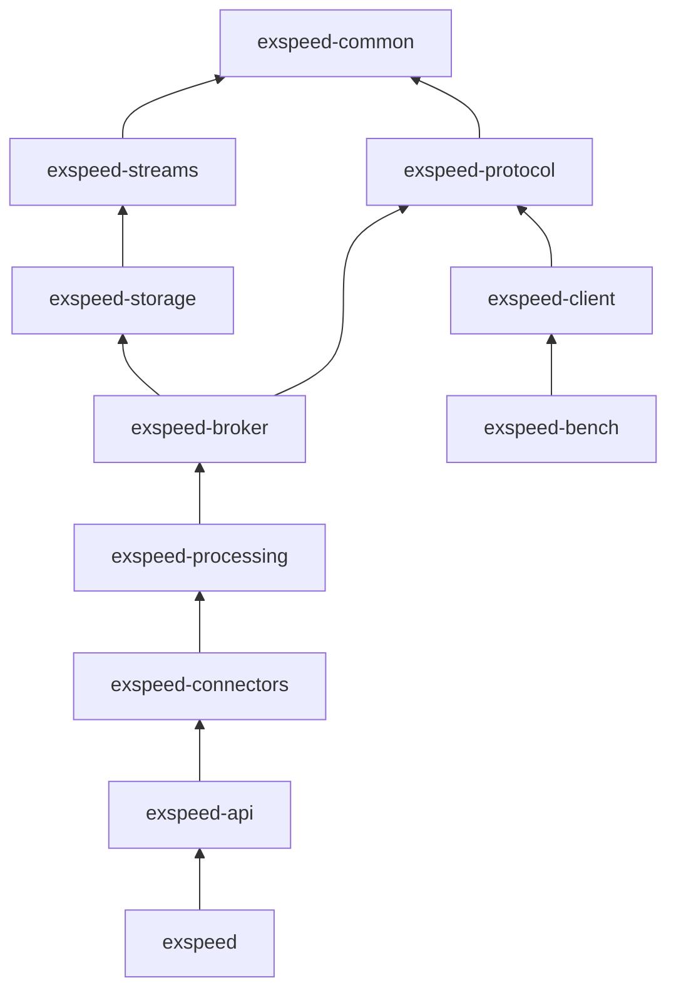
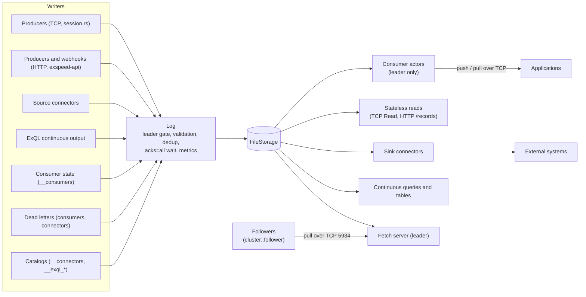
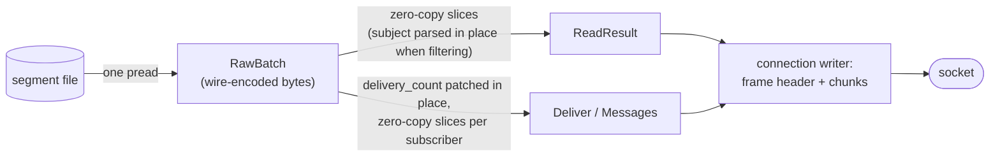

# Architecture

This page describes how Exspeed is built: its crates, the write and read
paths, the on-disk format, and the order in which the server starts.

## Crates

Arrows point from a crate to the crates it depends on. Indirect
dependencies are left out (most crates also use `exspeed-common` directly,
for example).



| Crate | Contents |
|-------|----------|
| `exspeed-common` | Shared types (`StreamName`, `Offset`), subject filters, auth store, metrics |
| `exspeed-streams` | `StorageEngine` trait (async), `Record` / `StoredRecord`, `StreamConfig` |
| `exspeed-protocol` | Wire protocol: frame codec, opcodes, client protocol v2 (`client.rs`) |
| `exspeed-storage` | `FileStorage` (segments, sparse indexes, retention, compaction), `MemoryStorage` |
| `exspeed-broker` | `Log` (the single write path), `BrokerAppend` (dedup), consumers, leases and leadership, cluster replication (`cluster/`) |
| `exspeed-connectors` | Connector manager, per-connector supervisor, retry/DLQ, offset stores, built-in plugins (record transforms come from `exspeed-processing`) |
| `exspeed-processing` | ExQL: parser, planner, bounded queries on DataFusion, continuous runtime |
| `exspeed-api` | Axum HTTP API, auth and leader-gate middleware, webhooks |
| `exspeed` | Binary: CLI, server bootstrap (`cli/server.rs`), TCP sessions (`session.rs`) |
| `exspeed-client` | Async Rust client for protocol v2 (also used by the benchmarks and tests) |
| `exspeed-bench` | Benchmark harness (not shipped in the image) |
| `exspeed-testkit` | Test helpers |

## Data flow



Every write, whatever its origin, goes through `exspeed_broker::log::Log`.
It enforces the leader gate, validates records, applies `msg_id` dedup,
appends to storage, waits for the in-sync replicas in a cluster with
`acks = all`, and records metrics. The one other writer is the replication
follower, which applies the leader's records with `StorageEngine::append_at`
(and mirrors trims and truncations) while the node is not the leader (see
[high-availability.md](high-availability.md)).

## Consumers

`exspeed_broker::consumer::ConsumerManager` runs one actor task per
consumer, only on the leader, under the leadership token. An actor owns a
pure state machine (`consumer/core.rs`), which holds:

- the next offset to read;
- the ack floor;
- the in-flight records, with deadlines and delivery counts;
- the records scheduled for redelivery;
- the records held back: delayed records (`exspeed-delay`) until they are
  due, and a prioritized consumer's lookahead buffer, ordered by priority.
  They are persisted as pending with zero deliveries; after a restart their
  due time is read back from the record.

The actor feeds push subscriptions (credit-based) and pull waiters from the
log, reacting to `watch_appends` notifications. It redelivers on timeout,
nack, or subscriber loss; dead-letters through `Log` with idempotency keys;
and persists a snapshot to the compacted `__consumers` stream at most every
100 ms. On promotion, a new leader restores every consumer from
`__consumers`. Delivery is at-least-once.

**Retention by acknowledgement.** After each successful persist, an actor
reports its ack floor to the manager. A task on the leader keeps the floors
per stream and trims `work_queue` and `interest` streams to the lowest one
(an `interest` stream with no consumers to its head) through `Log::trim`,
so the trim takes the single write path and replicates.

## Core messaging and key-value

`exspeed_broker::pubsub::CoreBus` holds the core-message subscriptions in
memory: a publish matches each subscription's filter, picks one member per
queue group, and `try_send`s to the subscriber connection's bounded queue
(a full queue drops the message). The bus is open only during a leadership
tenure; when the tenure's token is cancelled it ends every subscription.

`exspeed_broker::kv::Kv` maps a bucket to the stream `KV_<bucket>` with
`max_msgs_per_subject` = history. Gets go through the storage's per-subject
index; puts run under a per-bucket lock and compare the expected revision
against the committed log (`latest_committed_for_subject`), then append
through `Log`.

`crates/exspeed/src/nats/` serves the core NATS protocol on its own
listener ([nats.md](nats.md)). `proto.rs` parses and encodes the text
protocol; each connection runs one loop that reads operations, answers
pings and writes the connection's bus deliveries in batches, deliveries
first, so a client that publishes faster than its own subscriptions are
written is slowed by TCP backpressure instead of losing messages. NATS
`sid`s map to bus subscription ids, so the two protocols share one bus.

`exspeed_broker::capture::Capture` maps subjects to the stream whose
`capture_subjects` match (a table rebuilt when stream metadata changes).
Each connection that publishes a captured message gets a pipeline task
that appends its messages in order, batching consecutive ones for the same
stream, and publishes a JetStream-style `PubAck` to each message's reply
subject.

## Wire protocol

Clients use protocol v2 ([protocol.md](protocol.md)). Every frame has a
10-byte header:

```
[version u8 = 2][opcode u8][correlation_id u32 LE][payload_len u32 LE][payload …]
```

Each TCP connection is served by `crates/exspeed/src/session.rs`:

- a reader loop decodes and dispatches requests;
- one writer task owns the socket;
- `Publish` and `PublishBatch` go through the connection's publish
  pipeline, a task that applies them in arrival order while the reader
  keeps going. Requests already queued for the same stream are appended
  together (one `Log` batch, so one fsync), up to 4,096 records or 8 MiB,
  and each request gets its own reply;
- requests that wait (pull, long-poll read, query) run concurrently, at
  most 64 per connection, so replies can arrive out of order;
- each subscription has a forwarder task that turns consumer events into
  `Deliver` pushes (correlation id 0).

Frame payloads are capped at 16 MiB.

## Storage layout

```
<data-dir>/
  .exspeed.lock                      exclusive flock held by the running server
  credentials.toml                   optional, auto-detected
  node_id                            this node's id, generated on first start
  .trash/                            streams being deleted (cleared on startup)
  cluster/epochs/<stream>.json       per-stream leader-epoch history (cluster mode)
  streams/<stream>/
    stream.json                      retention, limits, dedup and compaction config
    dedup_snapshot.bin               periodic dedup-map snapshot (single node)
    partitions/0/
      log_start                      log start offset (only once records were trimmed)
      00000000000000000000.seg       append-only segment (wire-encoded records), rolls at 256 MiB
      00000000000000000000.idx       sparse offset + time index, one entry about every 4 KiB
      00000000000000000000.meta      sealed-segment metadata (offsets, timestamps, length)
      truncate.json                  only while a truncation is in progress
  streams/__consumers/               consumer state (internal compacted stream)
  streams/__connector_offsets/       connector offsets (internal compacted stream)
  streams/__connectors/              API-created connector configs (internal compacted stream)
  streams/__exql_queries/            continuous query definitions + desired state
                                     (internal compacted stream; checkpoints live in
                                     the stream __exql_ckpt_<id>)
  streams/__exql_connections/        API-created ExQL connections (internal compacted stream)
  connectors.d/*.toml                connector configs (hot-reloaded, operator-managed)
  connections.d/*.toml               ExQL connections (operator-managed)
  connector-offsets/                 connector offsets (EXSPEED_CONNECTOR_OFFSET_STORE=file only;
                                     the default stores them in the __connector_offsets stream)
  connectors.migrated/               JSON definitions from connectors/, connections/
  connections.migrated/              and exql/queries/, kept after the server imported
  exql/queries.migrated/             them into the internal streams above
```

**Cluster metadata lives in the log.** Everything created through the API
(consumers, connector configs and offsets, ExQL queries and connections) is
stored as records in a compacted internal stream: the key is the object's
id, the value its JSON definition, and a delete is a tombstone. These
streams take the single write path, so only the leader can change them and
they replicate like any other stream. Each leader tenure starts by reloading
the catalogs from those streams, so a promoted follower runs exactly what
the old leader had. Files under `connectors.d/` and `connections.d/` stay
node-local on purpose: operators ship the same files to every pod. Dedup
snapshots are node-local caches that can be rebuilt from the log.

**Log start offset.** Retention and compaction work on whole segments, but
some removals are record-exact: `trim_up_to` (a work queue's acks, a
follower mirroring the leader), and `max_msgs` with `discard = "old"`. They
move the partition's log start offset: readers treat records below it as
gone, and segments entirely below it are deleted. The offset is persisted in
`log_start` within a second of moving (losing the last move in a crash only
brings back records that were already removed), never moves past the high
watermark, and is carried by backups and replication.

**Read-time visibility.** A stream with a TTL or `max_msgs_per_subject`
hides records from readers (reads, SQL, consumers) as it serves them:
expired records, and records that N newer records of the same subject
superseded. The per-subject check uses an in-memory index of each subject's
newest offsets, maintained by the writer thread after each commit and
rebuilt from the log on startup or when the limit changes. A record above
the high watermark (not yet replicated) never supersedes an older one.
Compaction later removes hidden records from disk. Replication and state
rebuilds read the committed log without these filters.

Segment files are named after their base offset (20 digits, zero-padded)
and start with a 16-byte header: magic `EXSG`, format version 3, base
offset. The server refuses a segment with any other version and names the
file in the error.

**Record format.** After the header, a segment holds records back to back
in exactly the encoding the client protocol uses for a `WireRecord`
([protocol.md](protocol.md#shared-structures)). One module,
`exspeed_common::record_format`, defines it for the storage engine, the
server, the Rust client and (mirrored) the TypeScript SDK. All integers are
little-endian:

| Bytes | Field | Notes |
|-------|-------|-------|
| 0–3 | `len` `u32` | Bytes after this field (record size − 4). |
| 4–7 | `crc` `u32` | CRC32C of bytes 10..end, i.e. everything after `delivery_count`. |
| 8–9 | `delivery_count` `u16` | Always 0 on disk. The server patches it in place when a consumer delivers the record, which is why the CRC skips it. |
| 10–17 | `offset` `u64` | |
| 18–25 | `timestamp_ns` `u64` | Append time, nanoseconds since the Unix epoch. |
| 26– | `subject` | `u16` length + UTF-8. |
| | `key` | `u8` flag (0 absent, 1 present), then `u32` length + bytes when present. |
| | `value` | `u32` length + bytes. |
| | `headers` | `u16` count, then (`u16` length + UTF-8 key, `u16` length + UTF-8 value) pairs. |

A record is 35 bytes plus its subject, key, value and headers, and at most
64 MiB. The per-record length and CRC are what recovery, compaction and
backup use to walk and validate a segment, and how torn writes are
detected: the scan stops at the first record whose length runs past the end
of the file or whose CRC doesn't match.

Why this shape: the length prefix lets the server find record boundaries
(and a client skip records) without parsing; the fixed-position
`delivery_count`, kept outside the CRC, can be set per delivery without
re-encoding or recomputing anything; and nanosecond timestamps are what the
storage engine already keeps for `seek_by_time` and replication, so the
wire carries the stored value instead of a converted one.

**Writes.** Each partition has one dedicated writer thread. Every change to
the partition (appends, segment rolls, retention, truncation, installing a
compacted segment) runs on that thread, so file IO never blocks the tokio
runtime. Appends are group-committed: the writer collects requests for up
to `--storage-flush-window-us` (or until a flush threshold is reached),
writes them in one `write` and, in `sync` mode, issues one `fdatasync`.
Index entries are appended to the `.idx` file as the segment grows, so a
roll never re-reads a segment. The time column holds the running maximum
timestamp, so it is monotonic even when producer timestamps are not.

**High watermark.** Readers see records only below the high watermark. In
`sync` mode it advances after the fsync; in `async` mode after the write.
`watch_appends` wakes subscribers when it moves. In a cluster a **read
floor** holds it back further on user streams: readers see a record only
once every in-sync replica has it (see
[high-availability.md](high-availability.md#what-readers-see)). Replication
and state rebuilds read the committed log above the floor
(`committed_bounds`, `read_batch_committed`).

**Reads.** Readers never take the writer's lock and never fsync. They load
the segment list (swapped atomically by the writer), binary-search it, look
up the sparse index, then `pread` forward. `seek_by_time` returns the first
record with a timestamp at or after the target, across all segments, or the
high watermark if there is none. There are two read APIs:

- `StorageEngine::read_raw` returns a `RawBatch`: the records' bytes as
  they are in the segment, plus a count, the next offset and the high
  watermark. `FileStorage` does one `pread` per segment touched, sized from
  the limits and the segment's average record size (a second `pread` only
  when that estimate was low), checks each record's length and CRC, and
  returns a view of the read buffer. It never decodes a record or
  allocates per record, and once it has a record it stops at the segment
  boundary rather than copying two buffers together. This is what serves
  clients: TCP `Read`, consumer push (`Deliver`) and pull (`Messages`).
- `read` / `read_batch` decode into `StoredRecord`s, for everything that
  needs the fields: ExQL, connectors, the HTTP API, replication, dead
  lettering.



A stateless `Read` with no subject filter sends the batch as one chunk.
With a filter, each record's subject is parsed in place (no allocation) and
each run of consecutive matching records becomes one slice of the buffer.
A consumer sets `delivery_count` to 1 for the whole batch (or to the
redelivery count for a single redelivered record), then hands each push
subscriber or pull waiter slices of the buffer, one per run of consecutive
records it receives. The connection's writer task writes the frame header,
the small response head and the chunks into a 64 KiB buffered writer
(large chunks bypass the buffer), and flushes once per burst of queued
frames. The record bytes are therefore copied once from the page cache by
`pread` and once into the socket.

**Failures.** If a write or fsync fails, the writer truncates the file back
to the last committed length and returns an error. The failed batch was
never visible or acknowledged, so its offsets are handed out again; no
committed offset is ever reused. If that truncation also fails, the
partition is marked failed: it stays readable, rejects every write, and
reports the reason through `FileStorage::partition_status` and
`failed_streams`. A restart runs recovery and clears it.

**Crash safety.** Sidecar files (`stream.json`, `.meta`, `truncate.json`)
are written to a temporary file, renamed, and the directory is fsynced.
Creating or deleting a segment also fsyncs the directory. `truncate_from`
writes `truncate.json` first and is completed by recovery if the process
dies part-way. At startup only the active segment is scanned: offsets must
be strictly increasing and every frame must pass its CRC. A torn tail is
truncated. Corruption with valid data after it fails recovery in `sync`
mode and is truncated (with a warning) in `async` mode. Sealed segments are
opened from their `.meta` file without reading the data (a missing or stale
`.meta` triggers a CRC scan). A partition whose recovery fails (mid-file
corruption in `sync` mode, a corrupt sealed segment, overlapping segments)
does not stop the server: it is logged at `error` level and opened fenced,
with no writer thread, readable up to the first damaged segment, rejecting
writes, retention and compaction with `PartitionFailed`, and listed by
`failed_streams`. The damaged files are left untouched; restore or remove them
and restart.

**Retention** runs every 60 s on the leader; each pass executes on the
partition's writer thread. It deletes whole sealed segments from the front
of the log, by age (the newest record is older than `max_age_secs`) or by
size (total size above `max_bytes`). The active segment is never deleted.
Followers don't run retention: they trim up to the leader's earliest
offset.

**Compaction.** A stream with `compaction = true` in its config is visited
by a background compactor every 60 s. It rewrites sealed segments to keep
only the newest record for each key (looking across the whole log,
including the active segment). Records without a key are always kept. A
record with a key and an empty value is a tombstone: it deletes the key and
is itself removed once it is older than `tombstone_retention_secs`
(default 24 h). Offsets are preserved, so a compacted stream has offset
gaps, and every read path skips them. A rewrite goes to `*.compacting`
files, is fsynced, renamed over the original, and the segment list is then
swapped atomically; a crash at any point leaves either the old or the new
segment. The internal metadata streams are compacted. For other streams,
set `compaction` in the HTTP create request (`POST /api/v1/streams`) or in
the `StreamSpec` of the protocol's `CreateStream` / `UpdateStream`. The
HTTP `PATCH` and the CLI don't change it.

**Replication.** `StorageEngine::append_at` appends records that already
carry their offsets, timestamps and keys. Offsets must be strictly
increasing and at or above the next offset; gaps are allowed. It is
implemented by `FileStorage` and `MemoryStorage` and is how followers apply
replicated records (`exspeed_broker::cluster::follower`).

## Server startup sequence

`crates/exspeed/src/cli/server.rs` starts the server in this order:

1. Load the credentials store (from `credentials.toml` and/or the shared
   token) and resolve the TLS certificate paths.
2. Take the data-dir `flock`.
3. Bind the client (TCP) and HTTP listeners, so a port conflict fails
   startup. Connections wait in the backlog until the server serves them.
4. Open `FileStorage`. This recovers each stream's active segment with a
   tail scan and starts one writer thread per stream and the compactor.
5. Build `BrokerAppend`. On a single node, apply each stream's dedup
   settings and rebuild the dedup maps in the background: from the
   snapshot plus a scan of what follows it, or with a scan of the dedup
   window when there is no usable snapshot. A cluster node skips this and
   rebuilds from the replicated log when it is promoted.
6. Build the lease backend (a no-op that always grants on a single node),
   read or create `node_id`, bind the cluster port (cluster mode), and
   build the `Broker`, which contains the `Log` and the `ConsumerManager`.
7. In cluster mode build `cluster::Cluster` (epoch store, write-path hooks,
   follower, fetch server). Start `ClusterLeadership`, with the cluster as
   its role hooks, gate writes on leadership, and serve the cluster port.
   A cluster node starts as a follower; on acquiring the lease it stops
   following, stamps the new epoch on every stream and starts the dedup
   rebuild before writes open. The server then waits briefly (at most 2 s)
   for leadership and logs its role.
8. On a single node, spawn the dedup snapshot task (every 60 s, and once
   more at shutdown).
9. Build the connector offset store and the `ConnectorManager`, load the
   connector configs and start the `connectors.d/` watcher. Build the
   `ExqlEngine` and load its catalog. Failing to read either catalog stops
   startup with an error.
10. Spawn the leader supervisor. Each time this node becomes leader it
    reloads the ExQL catalog and the API-created connector configs, starts
    the consumers (restored from `__consumers`), then runs connectors,
    continuous queries and retention until the tenure ends. If that work
    can't start, the node steps down (see
    [operations.md](operations.md#startup-failures)).
11. Spawn the dedup eviction task (every 60 s).
12. Load the TLS configs, start serving the HTTP API, and mark the server
    ready (`/readyz`).
13. Enter the TCP accept loop, which spawns one task per connection.

Shutdown runs the other way; the steps are in
[operations.md](operations.md#graceful-shutdown).

## Concurrency model

- **One tokio runtime.**
- **Storage:** one writer OS thread per partition does group commit and all
  file IO, off the tokio runtime. Readers take no lock. One more thread runs
  the compactor.
- **Consumers:** one actor task per consumer (leader only), woken by
  `watch_appends`, timers and client commands.
- **Connections:** a reader, a writer, a publish pipeline (started on the
  first publish), one task per waiting request, and one forwarder per
  subscription.
- **Connectors:** one supervisor task each, under the leader's cancellation
  token. The supervisor runs the plugin, catches panics and restarts it with
  backoff (see [connectors.md](connectors.md#status-restarts-and-metrics)).
- **Continuous queries:** one task each, under the leader's cancellation
  token.
- **Cluster:** a leadership task (lease heartbeat or polling), the follower
  task while following, and one task per follower connection on the
  leader's fetch server.
