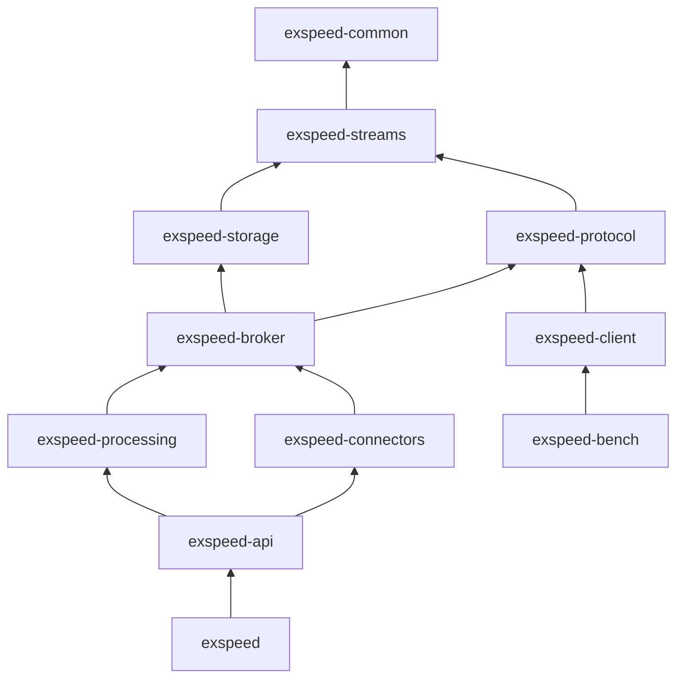
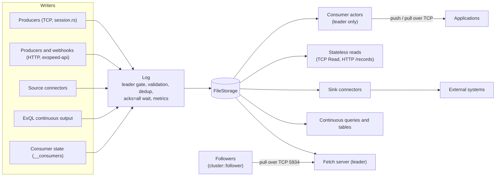

# Architecture

This page describes the system **as it is today**. The proposed target
architecture is in [REVIEW.md §5](REVIEW.md#5-proposed-target-architecture).

## Crates

Arrows point from a crate to the crates it depends on.



| Crate | Contents |
|-------|----------|
| `exspeed-common` | Shared types (`StreamName`, `Offset`), subject filters, auth store, metrics |
| `exspeed-streams` | `StorageEngine` trait (async), `Record` / `StoredRecord`, `StreamConfig` |
| `exspeed-protocol` | Wire protocol: frame codec, opcodes, client protocol v2 (`client.rs`) |
| `exspeed-storage` | `FileStorage` (segments, sparse indexes, retention, compaction), `MemoryStorage` |
| `exspeed-broker` | `Log` (the single write path), `BrokerAppend` (dedup), consumers, leases and leadership, cluster replication (`cluster/`) |
| `exspeed-connectors` | Connector manager, per-connector supervisor, retry/DLQ, offset stores, built-in plugins |
| `exspeed-processing` | ExQL: parser, planner, bounded and continuous runtimes |
| `exspeed-api` | Axum HTTP API, auth and leader-gate middleware, webhooks |
| `exspeed` | Binary: CLI, server bootstrap (`cli/server.rs`), TCP sessions (`session.rs`) |
| `exspeed-client` | Async Rust client for protocol v2 (also used by the benchmarks and tests) |
| `exspeed-bench` | Benchmark harness (not shipped in the image) |
| `exspeed-testkit` | Test helpers |

## Data flow



Every write, whatever its origin, goes through `exspeed_broker::log::Log`.
It enforces the leader gate, validates records, applies `msg_id` dedup,
appends to storage, waits for the in-sync replicas in a cluster with
`acks = all`, and records metrics. The one other writer is the replication
follower, which applies the leader's records with `StorageEngine::append_at`
while the node is not the leader (see [high-availability.md](high-availability.md)).

## Consumers

`exspeed_broker::consumer::ConsumerManager` runs one actor task per
consumer, only on the leader, under the leadership token. An actor owns a
pure state machine (`consumer/core.rs`), which holds:

- the next offset to read;
- the ack floor;
- the in-flight records, with deadlines and delivery counts;
- the records scheduled for redelivery.

The actor feeds push subscriptions (credit-based) and pull waiters from the
log, reacting to `watch_appends` notifications. It redelivers on timeout,
nack, or subscriber loss; dead-letters through `Log` with idempotency keys;
and persists a snapshot to the compacted `__consumers` stream at most every
100 ms. On promotion, a new leader restores every consumer from
`__consumers`. Delivery is at-least-once.

## Wire protocol

Clients use protocol v2 ([protocol.md](protocol.md)). Every frame has a
10-byte header:

```
[version u8 = 2][opcode u8][correlation_id u32 LE][payload_len u32 LE][payload …]
```

Each TCP connection is served by `crates/exspeed/src/session.rs`:

- a reader loop decodes and dispatches requests;
- one writer task owns the socket;
- requests that wait (pull, long-poll read, query) run concurrently, so
  replies can arrive out of order;
- each subscription has a forwarder task that turns consumer events into
  `Deliver` pushes (correlation id 0).

Frames are capped at 16 MB.

## Storage layout

```
<data-dir>/
  .exspeed.lock                      exclusive flock held by the running server
  credentials.toml                   optional, auto-detected
  .trash/                            streams being deleted (cleared on startup)
  streams/<stream>/
    stream.json                      retention, dedup and compaction config
    dedup_snapshot.bin               periodic dedup-map snapshot
    partitions/0/
      00000000000000000000.seg       append-only segment (wire-encoded records), rolls at 256 MB
      00000000000000000000.idx       sparse offset + time index, one entry about every 4 KiB
      00000000000000000000.meta      sealed-segment metadata (offsets, timestamps, length)
      truncate.json                  only while a truncation is in progress
  streams/__consumers/               consumer state (internal compacted stream)
  streams/__connector_offsets/       connector offsets (internal compacted stream)
  streams/__connectors/              API-created connector configs (internal compacted stream)
  streams/__exql_queries/            continuous query definitions + desired state
                                     (internal compacted stream; checkpoints live in
                                     the stream __exql_ckpt_<id>)
  streams/__exql_connections/        API-created ExQL connections (internal compacted stream)
  connectors.d/*.toml                connector configs (hot-reloaded, operator-managed)
  connections.d/*.toml               ExQL connections (operator-managed)
  connector-offsets/                 connector offsets (EXSPEED_CONNECTOR_OFFSET_STORE=file only;
                                     the default stores them in the __connector_offsets stream)
  connectors.migrated/               legacy files, kept after their one-time import
  connections.migrated/                (older versions kept API definitions under
  exql/queries.migrated/               connectors/, connections/ and exql/queries/)
```

**Cluster metadata lives in the log.** Everything created through the API
(consumers, connector configs and offsets, ExQL queries and connections) is
stored as records in a compacted internal stream: the key is the object's
id, the value its JSON definition, and a delete is a tombstone. These
streams take the single write path, so only the leader can change them and
they replicate like any other stream. Each leader tenure starts by reloading
the catalogs from those streams, so a promoted follower runs exactly what
the old leader had. Files under `connectors.d/` and `connections.d/` stay
node-local on purpose: operators ship the same files to every pod. Dedup
snapshots are node-local caches that can be rebuilt from the log.

Segment files are named after their base offset and start with a 16-byte
header (magic `EXSG`, format version 3). Older segment files are refused;
there is no migration because nobody runs Exspeed in production yet.

**Record format.** After the header, a segment holds records back to back
in exactly the encoding the client protocol uses for a `WireRecord`
([protocol.md](protocol.md#shared-structures)). One module,
`exspeed_common::record_format`, defines it for the storage engine, the
server, the Rust client and (mirrored) the TypeScript SDK. All integers are
little-endian:

| Bytes | Field | Notes |
|-------|-------|-------|
| 0–3 | `len` `u32` | Bytes after this field (record size − 4). |
| 4–7 | `crc` `u32` | CRC32C of bytes 10..end, i.e. everything after `delivery_count`. |
| 8–9 | `delivery_count` `u16` | Always 0 on disk. The server patches it in place when a consumer delivers the record, which is why the CRC skips it. |
| 10–17 | `offset` `u64` | |
| 18–25 | `timestamp_ns` `u64` | Append time, nanoseconds since the Unix epoch. |
| 26– | `subject` | `u16` length + UTF-8. |
| | `key` | `u8` flag (0 absent, 1 present), then `u32` length + bytes when present. |
| | `value` | `u32` length + bytes. |
| | `headers` | `u16` count, then (`u16` length + UTF-8 key, `u16` length + UTF-8 value) pairs. |

A record is 35 bytes plus its subject, key, value and headers, and at most
64 MiB. The per-record length and CRC are what recovery, compaction and
backup use to walk and validate a segment, so torn writes are detected as
before: the scan stops at the first record whose length runs past the end
of the file or whose CRC doesn't match.

Why this shape: the length prefix lets the server find record boundaries
(and a client skip records) without parsing; the fixed-position
`delivery_count`, kept outside the CRC, can be set per delivery without
re-encoding or recomputing anything; and nanosecond timestamps are what the
storage engine already keeps for `seek_by_time` and replication, so the
wire carries the stored value instead of a converted one.

**Writes.** Each partition has one dedicated writer thread. Every change to
the partition (appends, segment rolls, retention, truncation, installing a
compacted segment) runs on that thread, so file IO never blocks the tokio
runtime. Appends are group-committed: the writer collects requests for up
to `--storage-flush-window-us` (or until a flush threshold is reached),
writes them in one `write` and, in `sync` mode, issues one `fdatasync`.
Index entries are appended to the `.idx` file as the segment grows, so a
roll never re-reads a segment. The time column holds the running maximum
timestamp, so it is monotonic even when producer timestamps are not.

**High watermark.** Readers see records only below the high watermark. In
`sync` mode it advances after the fsync; in `async` mode after the write.
`watch_appends` wakes subscribers when it moves. A replication floor hook
(`FileStorage::set_replication_floor`) can hold it back further; nothing
sets it yet.

**Reads.** Readers never take the writer's lock and never fsync. They load
the segment list (swapped atomically by the writer), binary-search it, look
up the sparse index, then `pread` forward. `seek_by_time` returns the first
record with a timestamp at or after the target, across all segments, or the
high watermark if there is none. There are two read APIs:

- `StorageEngine::read_raw` returns a `RawBatch`: the records' bytes as
  they are in the segment, plus a count, the next offset and the high
  watermark. `FileStorage` does one `pread` per segment touched, sized from
  the limits and the segment's average record size (a second `pread` only
  when that estimate was low), checks each record's length and CRC, and
  returns a view of the read buffer. It never decodes a record or
  allocates per record, and once it has a record it stops at the segment
  boundary rather than copying two buffers together. This is what serves
  clients: TCP `Read`, consumer push (`Deliver`) and pull (`Messages`).
- `read` / `read_batch` decode into `StoredRecord`s, for everything that
  needs the fields: ExQL, connectors, the HTTP API, replication, dead
  lettering.


A stateless `Read` with no subject filter sends the batch as one chunk.
With a filter, each record's subject is parsed in place (no allocation) and
each run of consecutive matching records becomes one slice of the buffer.
A consumer sets `delivery_count` to 1 for the whole batch (or to the
redelivery count for a single redelivered record), then hands each push
subscriber or pull waiter slices of the buffer, one per run of consecutive
records it receives. The connection's writer task writes the frame header,
the small response head and the chunks into a 64 KiB buffered writer
(large chunks bypass the buffer), and flushes once per burst of queued
frames. The record bytes are therefore copied once from the page cache by
`pread` and once into the socket.

**Failures.** If a write or fsync fails, the writer truncates the file back
to the last committed length and returns an error. The failed batch was
never visible or acknowledged, so its offsets are handed out again; no
committed offset is ever reused. If that truncation also fails, the
partition is marked failed: it stays readable, rejects every write, and
reports the reason through `FileStorage::partition_status` and
`failed_streams`. A restart runs recovery and clears it.

**Crash safety.** Sidecar files (`stream.json`, `.meta`, `truncate.json`)
are written to a temporary file, renamed, and the directory is fsynced.
Creating or deleting a segment also fsyncs the directory. `truncate_from`
writes `truncate.json` first and is completed by recovery if the process
dies part-way. At startup only the active segment is scanned: offsets must
be strictly increasing and every frame must pass its CRC. A torn tail is
truncated. Corruption with valid data after it fails recovery in `sync`
mode and is truncated (with a warning) in `async` mode. Sealed segments are
opened from their `.meta` file without reading the data (a missing or stale
`.meta` triggers a CRC scan). A partition whose recovery fails (mid-file
corruption in `sync` mode, a corrupt sealed segment, overlapping segments)
does not stop the server: it is logged at `error` level and opened fenced,
with no writer thread, readable up to the first damaged segment, rejecting
writes, retention and compaction with `PartitionFailed`, and listed by
`failed_streams`. The damaged files are left untouched; restore or remove them
and restart.

**Retention** runs every 60 s on the writer thread. It deletes whole sealed
segments from the front of the log, by age (the newest record is older than
`max_age_secs`) or by size (total size above `max_bytes`). The active
segment is never deleted.

**Compaction.** A stream with `compaction = true` in its config is visited
by a background compactor every 60 s. It rewrites sealed segments to keep
only the newest record for each key (looking across the whole log,
including the active segment). Records without a key are always kept. A
record with a key and an empty value is a tombstone: it deletes the key and
is itself removed once it is older than `tombstone_retention_secs`
(default 24 h). Offsets are preserved, so a compacted stream has offset
gaps, and every read path skips them. A rewrite goes to `*.compacting`
files, is fsynced, renamed over the original, and the segment list is then
swapped atomically; a crash at any point leaves either the old or the new
segment. Compaction can only be turned on through `StreamConfig` (for the
internal metadata streams planned in REVIEW.md §6); the HTTP API and CLI do
not expose it yet.

**Replication.** `StorageEngine::append_at` appends records that already
carry their offsets, timestamps and keys. Offsets must be strictly
increasing and at or above the next offset; gaps are allowed. It is
implemented by `FileStorage` and `MemoryStorage` and is how followers apply
replicated records (`exspeed_broker::cluster::follower`).

## Server startup sequence

`crates/exspeed/src/cli/server.rs` starts the server in this order:

1. Take the data-dir `flock`.
2. Load credentials and TLS.
3. Open `FileStorage`. This recovers each stream's active segment with a
   tail scan and starts one writer thread per stream and the compactor.
4. Build `BrokerAppend`, then rebuild the dedup maps in the background.
   These come from the snapshot when one exists, otherwise from a scan.
5. Build the lease backend, bind the cluster port (cluster mode), and build
   the `Broker`, which contains the `Log` and the `ConsumerManager`.
6. In cluster mode build `cluster::Cluster` (epoch store, write-path hooks,
   follower, fetch server). Start `ClusterLeadership` with it as the role
   hooks, and gate writes on leadership. A node starts as a follower;
   on acquiring the lease it stops following, stamps the new epoch on every
   stream and rebuilds dedup state before writes open.
7. Build the `ConnectorManager` and `ExqlEngine`, and load their configs and
   queries.
8. Spawn the background tasks: the dedup snapshot task and the leader
   supervisor. When this pod becomes leader, the supervisor starts the
   consumers (restored from `__consumers`), connectors, continuous queries
   and retention.
9. Spawn the HTTP API.
10. Enter the TCP accept loop, which spawns one task per connection.

## Concurrency model

- **One tokio runtime.**
- **Storage:** one writer OS thread per partition does group commit and all
  file IO, off the tokio runtime. Readers take no lock.
- **Consumers:** one actor task per consumer (leader only), woken by
  `watch_appends`, timers and client commands.
- **Connections:** a reader, a writer and one forwarder per subscription.
- **Connectors:** one supervisor task each, under the leader's cancellation
  token. The supervisor runs the plugin, catches panics and restarts it with
  backoff (see [connectors.md](connectors.md#status-restarts-and-metrics)).
- **Continuous queries:** one task each, under the leader's cancellation
  token.
