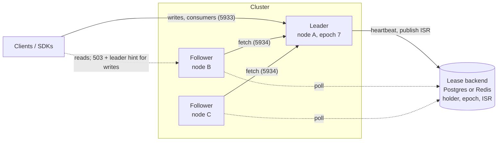
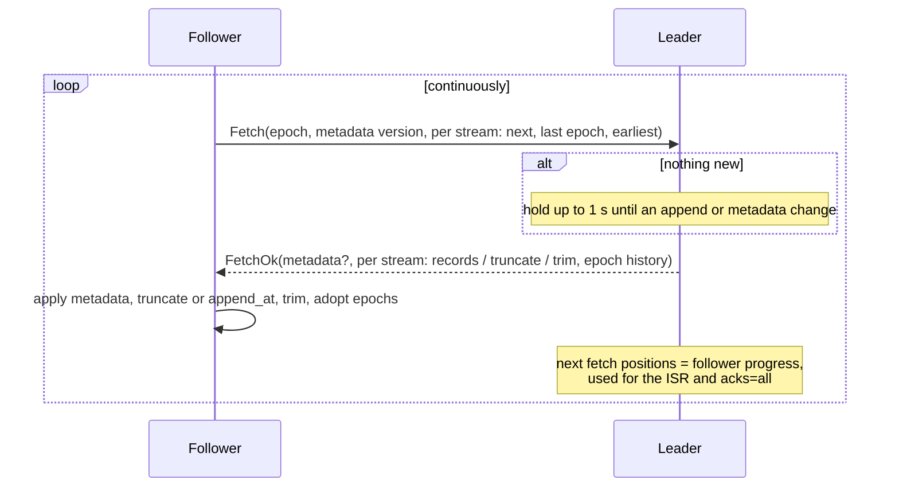
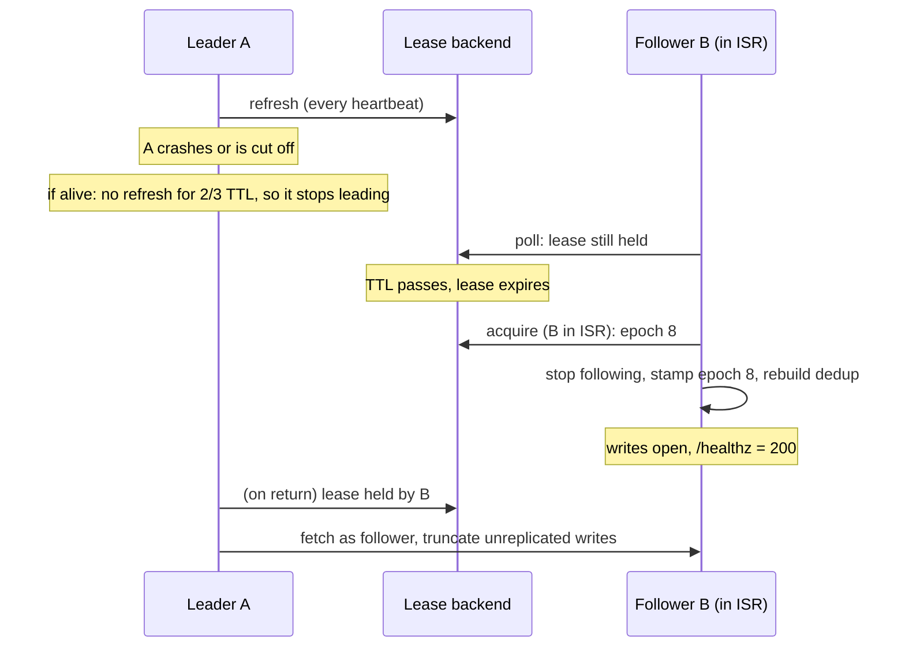

# High availability

An Exspeed cluster is a set of nodes (typically three), each with its own
data directory, sharing a **lease backend** (Postgres or Redis). One node
holds the lease and is the **leader**: it alone accepts writes and runs
consumers, connectors, continuous queries and retention. The others are
**followers**: they replicate the leader's log and take over when it fails.

- **Everything replicates.** Every stream, internal ones included
  (`__consumers`, `__connector_offsets`, ExQL checkpoints and catalogs), with
  the same offsets, timestamps, keys and headers. A new leader resumes
  consumers, connectors and continuous queries from the replicated state.
- **Acknowledged writes survive failover.** With `acks = "all"` (the
  default) a write is acknowledged once every in-sync replica has it, and
  only an in-sync replica can be elected.
- **No split brain.** Each leadership has an epoch (a fencing token). A
  leader that loses the lease stops before anyone else can take it, and any
  writes it accepted but never replicated are truncated when it rejoins.
- **Clients follow the leader.** Followers reject writes with `503` and
  name the leader. The SDKs find the leader from a list of seed addresses
  and find the new one after a failover.



## How it works

### Leader election

The lease is one record in the backend:

| Field | Meaning |
|-------|---------|
| `holder` | node id of the current (or last) holder |
| `epoch` | incremented on every acquisition |
| `expires_at` | the backend's clock; the lease is free once it passes |
| `replication_endpoint` / `client_endpoint` | where followers and clients reach the holder |
| `isr` | the in-sync replicas the holder last published |

The holder refreshes the lease every `lease_heartbeat_secs`. It considers the
lease lost on the first refresh that finds another holder, or when two
thirds of `lease_ttl_secs` pass without a successful refresh. So it stops
acting as leader well before the backend lets anyone else in. Followers poll
the record every heartbeat interval and try to take the lease once it has
expired. All timing uses the backend's clock (`now()` in Postgres, `TIME` in
Redis), so node clocks don't matter.

Node ids are generated once and kept in `{data_dir}/node_id` (override with
`cluster.node_id`). A restarted node can take its own unexpired lease back.

### Promotion

A node that acquires the lease, before it opens writes:

1. stops its follower;
2. stamps the new epoch on every stream's epoch history;
3. starts rebuilding the dedup maps from the log. Until that finishes,
   writes carrying a `msg_id` get a retryable `503`; other writes are
   accepted at once.

Then `/healthz` turns 200, the write path opens, and the leader supervisor
starts consumers, connectors, continuous queries and retention.

### Replication

Followers pull. Each follower connects to the leader's cluster port (5934)
and repeatedly sends a fetch with its position in every stream: the next
offset, the epoch of its last record and its earliest offset. The leader
answers with the missing records, up to 8 MiB per fetch. When there is
nothing new, it holds the fetch for up to a second until something is
appended (a long poll), so replication latency is about one round trip.

Each response carries:

- **Metadata** when the follower's view is out of date: every stream with
  its config and a uid. The follower creates missing streams, applies config
  changes, deletes streams the leader no longer has, and recreates a stream
  whose uid changed (it was deleted and recreated on the leader).
- **Per stream:** records, a truncation point, or only the leader's earliest
  offset. The follower trims up to the leader's earliest offset, which is how
  retention reaches followers.



**Divergence.** Each stream has an epoch history: the offset where each
leader epoch started. A follower whose last record has epoch `e` asks, in
effect, "where does epoch `e` end in your log?" If the follower has records
beyond that point, a deposed leader wrote them and they were never
replicated, so the follower truncates them and continues from there. This
is the KIP-101 scheme Kafka uses.

### Durability: `acks`, the ISR and `min_insync_replicas`

A follower is **in sync** while it has caught up with the leader within the
last `replica_lag_max_ms`. Caught up means its fetch reached the high
watermarks of the previous response. The leader publishes the in-sync set,
itself included, in the lease record.

| `acks` | A write is acknowledged when | On leader failure |
|--------|------------------------------|-------------------|
| `all` (default) | every in-sync replica has it | no acknowledged write is lost (unless every in-sync replica fails) |
| `quorum` | every in-sync replica has it, and the in-sync replicas are a majority of `cluster.size` (writes fail with 503 otherwise) | no acknowledged write is lost while a majority of nodes survives |
| `leader` | the leader has written it locally | writes not yet replicated are lost |

`quorum` is `all` with `min_insync_replicas` raised to a majority of
`cluster.size` (2 of 3, 3 of 5). Every acknowledged write is on a majority
of nodes, and only one of those in-sync nodes can be elected.

- **Election:** with `unclean_leader_election = false` (the default), only
  a node in the published ISR can take the lease. A node that is missing
  acknowledged writes never becomes leader. If every ISR member is gone,
  the cluster waits for one to return. Set `unclean_leader_election = true`
  to prefer availability.
- **Shrinking the ISR:** a follower that falls behind leaves the ISR after
  `replica_lag_max_ms`. The leader publishes the smaller set before it stops
  waiting for that follower, so an acknowledged write is always on every
  published ISR member.
- **`min_insync_replicas`:** with `acks = "all"`, writes fail with `503`
  ("not enough in-sync replicas") while fewer replicas than this (leader
  included) are in sync. Use `2` on a three-node cluster to never
  acknowledge a write that only one node has. The default `1` keeps
  accepting writes on a lone leader.
- **Timeouts:** a write that isn't replicated within `ack_timeout_ms` fails
  with a retryable `503`. It is in the leader's log and may still survive,
  so retry it with the same `msg_id`.

After a failover, members of the previous ISR get `replica_lag_max_ms` to
reconnect before the new leader drops them from the ISR. Writes during that
window wait for them.

Stream create, update and delete are metadata. They replicate on the next
fetch, but writes don't wait for them.

## Running a cluster

### Requirements

1. **A lease backend:** Postgres or Redis, reachable from every node.
2. **One data directory per node.** Nodes never share storage.
3. **Addresses:** `cluster.advertise` (where peers reach this node's
   replication port) and `cluster.client_advertise` (where clients reach
   its client port). Both are needed when the bind addresses are wildcards,
   as they are in containers.
4. **With auth on:** a credential with the `replicate` action for the
   followers (`cluster.replicator_credential`):

   ```toml
   [[credentials]]
   name = "replicator"
   token_sha256 = "<sha256 of the token>"
   permissions = [{ streams = "*", actions = ["replicate"] }]
   ```

Start followers with **empty** data directories (or with a copy of the
leader's). A node whose directory holds unrelated data from a standalone
server is not detected as different. Its streams are reconciled by name,
and records at offsets the leader also has are kept.

### Configuration

```toml
[cluster]
lease = "postgres"
postgres_url = "postgres://exspeed:...@pg/exspeed"
advertise = "exspeed-0.exspeed:5934"
client_advertise = "exspeed-0.exspeed:5933"
replicator_credential = "..."
acks = "quorum"
size = 3
```

### TLS on the cluster port

With `cluster.tls = true` the cluster port serves the same certificate as
the client and HTTP ports (`[tls] cert` / `key`), and followers require TLS
when they connect to the leader. They verify the leader's certificate against the host of
its advertised endpoint (`cluster.advertise`) using `cluster.tls_ca` as the
trust roots. The default trust root is the `[tls]` certificate itself, which
fits one certificate shared by every node. With per-node certificates from a
CA, point `cluster.tls_ca` at the CA. Certificates need the advertised host
names (or IPs) as SANs, e.g. `*.exspeed-headless.<ns>.svc.cluster.local` in
Kubernetes.

```toml
[tls]
cert = "/etc/exspeed/tls/tls.crt"
key = "/etc/exspeed/tls/tls.key"

[cluster]
tls = true
tls_ca = "/etc/exspeed/tls/ca.crt"
```

Every setting, with environment variables, is in
[configuration.md](configuration.md#cluster-cluster).

### Kubernetes

The Helm chart (`deploy/helm/exspeed`) sets this up with `replicas: 3`:

- a StatefulSet with a volume per pod;
- a headless Service, so each pod has a stable DNS name for `advertise` and
  `client_advertise`;
- a client Service over all pods. Cluster-aware clients connect through it
  and follow the leader hint to the leader pod's DNS name. HTTP callers
  either use `/healthz` to pick the leader, or retry against the `leader`
  named in a follower's `503`.

```bash
helm install exspeed deploy/helm/exspeed \
  --set replicas=3 \
  --set cluster.postgresUrlSecret=pg \
  --set cluster.replicatorTokenSecret=replicator
```

### Clients

- **Rust:** `Client::connect_cluster(&["exspeed-0:5933", "exspeed-1:5933"], opts, wait)`
  connects to the leader, following hints. After a failover, reconnect the
  same way.
- **TypeScript:** `ExspeedClient.connect({ servers: ["exspeed-0:5933", "exspeed-1:5933"] })`.
  The client finds the leader, and finds the new one when it reconnects
  after a failover. Subscriptions are re-established.
- **Other clients:** connect anywhere and follow the `leader` field of
  `ConnectOk`, of `Metadata`, or of the `503` error detail
  ([protocol.md](protocol.md)). Behind a load balancer, route to the node
  whose `/healthz` returns 200.

Client-protocol reads (`Read`, `StreamInfo`, `ListStreams`, `Query`) work on
followers and return replicated data. Writes and consumers need the leader.
The HTTP API answers only on the leader (503 with the leader's address
elsewhere), except the probes, `/metrics`, `/api/v1/cluster`,
`/api/v1/leases` and `/api/v1/whoami`.

### Failover timing



| Event | Writes unavailable for about |
|-------|------------------------------|
| Leader shuts down (SIGTERM) | one heartbeat interval: the lease is released and a follower takes it at its next poll |
| Leader crashes or is cut off from the lease backend | `lease_ttl_secs` + one heartbeat interval (default about 18 s) |

Lower `lease_ttl_secs` for faster failover, at the cost of more lease
traffic and less tolerance for slow backends.

### Observability

| Where | What |
|-------|------|
| `GET /api/v1/cluster` (any node, admin) | node id, role, epoch, the leader's endpoints. On the leader: the ISR and each follower's lag and last fetch. On a follower: whether it is connected, its lag, and the last error |
| `GET /api/v1/leases` (any node, admin) | the raw lease record |
| `GET /healthz` | 200 on the leader only (with `leader_hint` otherwise) |
| metrics | `exspeed_is_leader`, `exspeed_replication_role`, `exspeed_replication_lag_records`, `exspeed_replication_records_applied_total`, `exspeed_replication_truncated_records_total`, `exspeed_replication_bytes_total`, `exspeed_lease_*` |

## How it is tested

| Test | What it proves |
|------|----------------|
| `cluster_test` (in-process, real TCP replication) | Replication of records, configs, deletes, consumer state, queries and connectors. Failover without losing acknowledged writes. Divergent-leader truncation, follower restart, `min_insync_replicas`. TLS replication, and refusal of an untrusted peer. |
| `cluster_test::randomized_partitions_and_restarts_lose_no_acknowledged_write` | Jepsen-style. Random lease partitions, replication links cut by a fault-injecting proxy, and node restarts run under a writer that retries with the same `msg_id`. Afterwards every acknowledged write is present exactly once, every value in the log was written by the client, and all nodes hold identical logs. |
| `crash_test::kill_9_in_a_three_node_cluster_loses_no_acknowledged_write` | Three real processes on a Postgres lease with `acks = "quorum"`, while the leader (usually) or a follower is SIGKILLed and restarted. Same checks. Runs in CI with Postgres. |
| `postgres_lease_test`, `redis_lease_test`, lease unit tests | One conformance suite for every lease backend: epochs, fencing, ISR-gated election, expiry, release. |

## Limits

- **Every node has every stream, by design.** One leader serves every
  stream, so the node that takes over must already hold all of them. A
  per-stream replication factor would leave a promoted node missing streams,
  so it is not planned. To scale writes, partition data across separate
  clusters. A cluster scales reads and availability, not write throughput.
- **Followers apply compaction themselves.** Compacted streams converge on
  the same contents, but a follower may keep superseded records slightly
  longer than the leader.
- **One lease backend.** Its availability bounds the cluster's: if Postgres
  or Redis is unreachable for longer than the lease TTL, the leader steps
  down and no one can take over until the backend returns.
