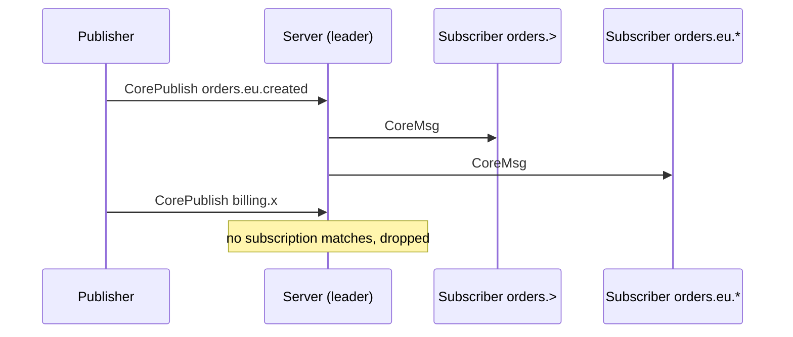

# Core messaging and request-reply

Next to streams, Exspeed carries **core messages**: published to a subject,
handed to the subscriptions live at that moment, and gone. Nothing is
written to disk, nothing is replayed, and delivery is at most once. Use them
for request-reply between services, notifications, cache invalidation and
anything else where a missed message doesn't matter or is retried by the
sender. Use a stream when a message must not be lost.

Core messages and stream records are separate: publishing to a stream doesn't
reach core subscribers, and a core publish isn't stored in any stream.



## Publish and subscribe

A subscription takes a subject filter with the usual wildcards (`*` one
token, `>` the rest; see [concepts.md](concepts.md#subjects-and-filters)).
A message is published to one concrete subject: no wildcards, no empty
tokens, the same size limits as a record.

```ts
// TypeScript
const sub = await client.subscribeCore("orders.>");
for await (const msg of sub) console.log(msg.subject, msg.text());

await client.publishCore("orders.eu.created", JSON.stringify({ id: 1 }));
```

```rust
// Rust
let mut sub = client.subscribe_core("orders.>", None).await?;
client.publish_core("orders.eu.created", "{\"id\":1}").await?;
let msg = sub.next().await;
```

## Queue groups

Subscriptions that name the same **queue group** share the subject's
messages: each message goes to one member of the group (round-robin), while
subscriptions outside the group still get their own copy. Run N replicas of a
service with the same group name to spread requests across them.

```ts
const sub = await client.subscribeCore("jobs.resize", { queue: "resizers" });
```

## Request-reply

A request is a core message with a `reply_to` subject. The responder
publishes its answer there. Clients do this for you:

```ts
// Responder (any number of instances, in one queue group)
const sub = await client.subscribeCore("svc.users.get", { queue: "users" });
for await (const req of sub) await req.respond(JSON.stringify(lookup(req.json())));

// Caller
const reply = await client.request("svc.users.get", JSON.stringify({ id: 7 }), { timeoutMs: 2000 });
```

Each connection subscribes once to its own inbox, `_INBOX.<random id>.*`,
and sends every request with `reply_to` set to a fresh subject in it, so a
request costs one round trip plus the responder's time.

When **nobody is subscribed** to the request's subject, the publish fails at
once with `404` ("no responders") instead of waiting for the timeout.

## Delivery and slow subscribers

- **At most once.** A message reaches the subscriptions that exist when it is
  published. A subscriber that connects later, or reconnects, misses what was
  published in between.
- **Slow subscribers lose messages.** Each connection has a queue of 65,536
  core messages. When it is full (the client isn't reading fast enough),
  further messages for that connection are dropped and counted in
  `exspeed_core_messages_dropped_total`; other subscribers are unaffected.
- **Leader only.** Core messaging runs on the cluster leader, like writes. On
  a standby, `CoreSubscribe` and `CorePublish` answer `503` with the leader's
  address. When leadership moves, every core subscription ends with `503`
  (`SubscriptionEnded`); clients reconnect to the new leader and subscribe
  again.

## Permissions

Core messages are authorized by subject: a credential needs a `subjects`
permission with `publish` or `subscribe` (or a wildcard-all `streams = "*"`
permission). Replying to an `_INBOX.…` subject and subscribing to your own
inbox are always allowed. See [security.md](security.md#subject-permissions).

## Protocol

`CorePublish` (`0x70`), `CoreSubscribe` (`0x71`), the `CoreMsg` push
(`0x8B`), and `Unsubscribe` for core subscription ids (which have the high
bit set). See [protocol.md](protocol.md#core-messaging).
