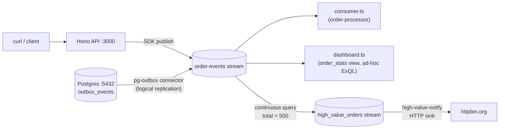

# Order Processing: E-Commerce Order Pipeline

A full-featured demo showing Exspeed as the backbone of an event-driven order processing system.

## What This Demonstrates

- **SDK publishing** — Hono API server publishes order events via the TypeScript SDK
- **Consumer workers** — background process consumes and processes orders in real time
- **Postgres outbox pattern** — a `postgres_outbox` source in CDC mode streams rows inserted into an outbox table through logical replication
- **Continuous queries** — an ExQL `CREATE STREAM … AS SELECT` filters high-value orders into their own stream
- **Sink connectors** — those high-value orders are forwarded to an HTTP endpoint
- **ExQL queries** — ad-hoc SQL queries and a materialized table (`CREATE MATERIALIZED VIEW`, an alias of `CREATE TABLE … AS SELECT`) over streaming data

## Architecture



## Prerequisites

- **Docker** and **Docker Compose**
- **Bun** (https://bun.sh)

## Running

### 1. Start infrastructure

```bash
docker compose up -d
```

This builds and starts the Exspeed server (from the repository root) and
Postgres with the order schema pre-loaded and logical replication enabled.
The server's `connectors.d/` and `connections.d/` directories are mounted
from `exspeed/`, so the two connectors below start with it, and the database
is registered as the ExQL connection `app-db`, which bounded queries can read
([external databases](../../docs/exql.md#external-databases)).

### 2. Install dependencies

```bash
bun install
```

### 3. Start the API server

```bash
bun run start
```

### 4. Start the consumer (in another terminal)

```bash
bun run consumer
```

### 5. Create some orders

```bash
curl -X POST http://localhost:3000/orders \
  -H 'Content-Type: application/json' \
  -d '{"customer_id": "cust-1", "total": 99.99, "region": "eu"}'

curl -X POST http://localhost:3000/orders \
  -H 'Content-Type: application/json' \
  -d '{"customer_id": "cust-2", "total": 750.00, "region": "us"}'

curl -X POST http://localhost:3000/orders \
  -H 'Content-Type: application/json' \
  -d '{"customer_id": "cust-3", "total": 24.50, "region": "eu"}'
```

You should see each order logged by the consumer in the other terminal.

### 6. Route high-value orders to the HTTP sink

The `high-value-notify` sink forwards the `high_value_orders` stream. Create
the continuous query that fills it (it starts from the beginning of
`order-events`, so orders created earlier are included):

```bash
curl -X POST http://localhost:8080/api/v1/queries \
  -H 'Content-Type: application/json' \
  -d @- <<'EOF'
{"sql": "CREATE STREAM high_value_orders AS SELECT key, payload->>'order_id' AS order_id, payload->>'customer_id' AS customer_id, payload->>'total' AS total, payload->>'region' AS region FROM \"order-events\" WHERE subject_part(subject, 1) = 'order' AND subject_part(subject, -1) = 'created' AND payload->>'total' > 500"}
EOF
```

Each matching order is written to `high_value_orders` (deduplicated with a
deterministic idempotency key) and posted to httpbin.org by the sink.

### 7. View the dashboard

```bash
bun run dashboard
```

This creates the materialized table `order_stats` (order count and revenue
per region) through `POST /api/v1/views`, reads it back with
`GET /api/v1/views/order_stats`, and runs an ad-hoc ExQL query that counts
orders by region.

## Connectors

CI runs `exspeed connector validate` on every connector config under
`examples/`, including both of these.

### pg-outbox (source)

Streams rows inserted into the `outbox_events` table in Postgres through a
logical replication slot (`mode = "cdc"`), in commit order, and deletes them
from the table once they are durable in Exspeed. In a production setup the
application writes the `orders` row and its `outbox_events` row in one
transaction, so an event is published if and only if the order was
committed.

Delivery is at-least-once: every record carries an `x-idempotency-key`
derived from the outbox row id, so a batch replayed after a crash is dropped
by the broker within the stream's dedup window (effectively-once there). See
`db/init.sql` for the schema and `exspeed/connectors.d/pg-outbox.toml` for
the connector config.

This demo's API publishes with the SDK directly; insert into
`outbox_events` to see the connector at work:

```bash
docker compose exec postgres psql -U app orderdb -c \
  "INSERT INTO outbox_events (aggregate_type, aggregate_id, event_type, payload)
   VALUES ('order', 'o-42', 'created', '{\"order_id\": \"o-42\", \"total\": 900, \"region\": \"eu\"}')"
```

The record lands in `order-events` with subject `order.created`.

### high-value-notify (sink)

Forwards the `high_value_orders` stream (orders with `total > 500`, written
by the continuous query from step 6) to an HTTP endpoint. Sink connectors
don't transform or filter on payload fields themselves; a continuous query
does that (a sink's `subject_filter` can select by subject). In this demo it
posts to httpbin.org so you can see the payload. Replace the URL with your
own webhook in production. See `exspeed/connectors.d/high-value-notify.toml`.

## ExQL Queries to Try

Once you have some orders in the stream, you can query them via the Exspeed HTTP API:

```bash
# Count orders by region
curl -X POST http://localhost:8080/api/v1/queries \
  -H 'Content-Type: application/json' \
  -d '{"sql": "SELECT payload->>'\''region'\'' AS region, COUNT(*) FROM \"order-events\" GROUP BY region"}'

# Find high-value orders
curl -X POST http://localhost:8080/api/v1/queries \
  -H 'Content-Type: application/json' \
  -d '{"sql": "SELECT * FROM \"order-events\" WHERE (payload->>'\''total'\'')::DECIMAL > 500"}'

# Latest 5 orders
curl -X POST http://localhost:8080/api/v1/queries \
  -H 'Content-Type: application/json' \
  -d '{"sql": "SELECT * FROM \"order-events\" ORDER BY offset DESC LIMIT 5"}'
```
